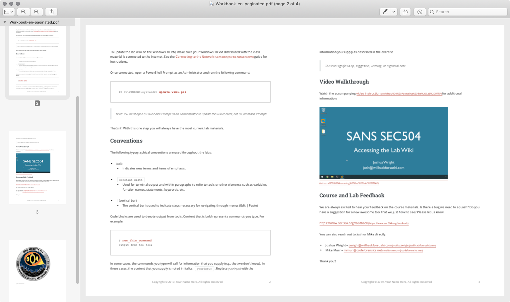
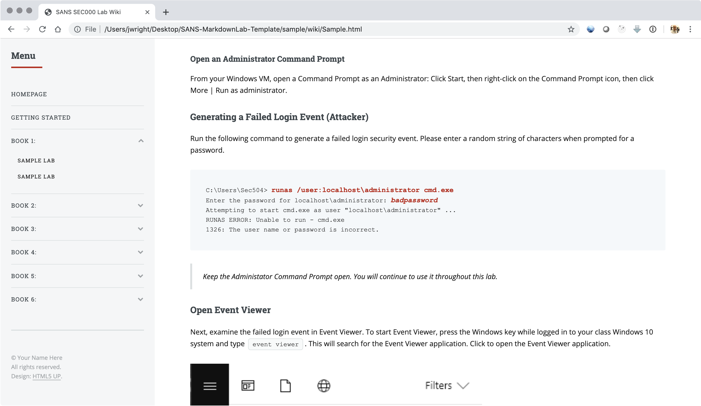

# SANS Markdown Wiki Template

## Introduction

This lab template system is a product of initial SEC504 development by John
Strand and Mick Douglas, then continued refinement by Mick and Josh Wright. It
aims to provide a simple mechanism for writing and maintaining lab exercises,
with emphasis on an attractive product (print and electronic) for students.

Questions, comments, concerns? Contact josh@wr1ght.net

## TL/DR Instructions

Run on Linux, macOS, or WSL. Install Pandoc, Puppeteer, Python 3, and PDFtk.
Use the examples in `content/` to create your labs. Edit
`content/wiki-template.html` to specify the order of your lab files by day. Run
`./publish.sh` to generate the HTML files for electronic distribution to
students and the workbook PDF. Run `./paginate.pdf` to add page numbers to the
workbook. Run `./clean.sh` to remove all the temporary files, then commit.

## Seeing the Product

Want to see what the product is before you read anything else? Screenshot
below from the print workbook and the HTML _wiki_ content. See the sample
PDF in `sample/Workbook-paginated.pdf`. See the sample HTML content in
`sample/wiki/index.html`.





## Getting Started

### Install Required Tools

This template for labs requires several utilities on UNIX-based platforms. It
is tested extensively on macOS, but should run well on Linux and Windows WSL
systems as well. Install the following utilities using the appropriate pacakge
manager for your platform:

+ Pandoc - https://pandoc.org/
+ Puppeteer - https://github.com/GoogleChrome/puppeteer (install NPM, then 
  `npm i puppeteer`)
+ Python 3 - https://www.python.org
+ PDFtk - https://www.pdflabs.com/tools/pdftk-the-pdf-toolkit/

Optionally run `./publish.sh check` to verify that the required utilities
are installed.

```
SANS-MarkdownLab-Template $ ./publish.sh check
Required utilities are installed.
```

Optional: If you an ubuntu user you can read through the ubuntu_install.sh 
script and modify as needed. This script has not been thoroughly tested. 
It should however provide you with the walkthrough for all the modules
needed on a Ubuntu 18.04+ system.

### Lab Writing Notes

Write the lab instructions in Markdown format, placing the files in the
`content/` directory. See the file `Sample.md` for an example. A few notes
on the sample content:

+ Code blocks are entered using `<pre>` tags, not the usual triple-backtick
  code fence notation. This is so user input (e.g. the stuff the student types
  can be noted with `<b>` tags, then formatted with CSS to stand out in print
  and the HTML _wiki_ content.
+ Images for labs should be placed in the `content/pics` directory, following
  your preferred naming convention. In the Markdown file, reference the pictures
  using a relative path (e.g. ``).
+ The `index.md` file is the top-level lab page, which should indicate your
  conventions for writing, instructions for updating the wiki on student VMs,
  author contact information, and a _last changed_ version identifier. See
  the supplied `index.md` file (use all or some of it as you see fit).
+ The files in `Templates/` are not included with the HTML wiki files. The
  content in this directory are Markdown stubs available for authors to 
  import for consistency in writing labs (_here's how to open a Command
  Prompt_, etc.)

### Modifying Framework Files

The only other file you need to edit is `content/wiki-template.html`. Edit
this file to organize your labs in the navigation page, referencing the
relative path in the current directory for each lab Markdown file using an
HTML file name extension. Edit this file to reflect your course information,
authors, coin logo, etc.

As you add new labs, or move labs around, you will need to edit this HTML
file. Otherwise it's a 1-time thing.

### Building the Lab Files

To generate the lab files, change to the top-level directory, then run
the `./publish.sh` script:

```
Desktop $ cd SANS-MarkdownLab-Template/
SANS-MarkdownLab-Template $ ./publish.sh
Generating wiki content for online viewing
HTML Post-processing    ...................................     3/       3
Generating wiki content for print
HTML Post-processing    ...................................     3/       3
Generating PDF files using Puppeteer
./publish.sh: line 117: kill: (22218) - No such process
Combining Lab PDF Files
```

This script produces all of the lab HTML files in the `wiki/` directory.
The contents of this directory can be distributed to students for lab use
(more on distribution thoughts below). The file `Workbook.pdf` is the
formatted PDF file is intended to be printed.

The `Workbook.pdf` file is not paginated; run the `./paginate.sh` script
to modify the PDF file to add page numbers:

```
SANS-MarkdownLab-Template $ ./paginate.sh
Paginating Workbook.pdf
....................................................................
Done: Workbook-paginated.pdf
```

### Removing Temporary Lab Content

Run the `./clean.sh` script to remove the temporary file content (e.g.
the `html/`, `print/`, `Workbook.pdf`, and `Workbook-paginated.pdf`
content. This content is regenerated when you run `./publish.sh`, so 
there is no need to check it in to Git.

### Building HTML Faster [OPTIONAL]

By default, `./publish.sh` will generate HTML and PDF files. PDF file
generation is only needed when courseware updates are turned in, so you may
want to skip that step if you are working on an interim lab update. If so, add
the `noprint` argument to the `./publish.sh` script:

```
SANS-MarkdownLab-Template $ ./publish.sh noprint
Generating wiki content for online viewing
HTML Post-processing    ...................................     3/       3
Skipping print file production.
```

## Distributing Lab Files

The `Workbook-paginated.pdf` file is intended to be included with your
courseware update for print purposes. The contents of the `wiki/` directory
are intended to be distributed to students for electronic access to the
labs.

There are a few strategies for how the HTML files should be distributed
to students:

+ **Henderson Model**: Create a new GitHub repo for each lab update. Include the
  contents of the `wiki/` directory in the repo for students. Name the repo
  something like `sec555-labs-e01`. Generate and distribute a read-only GitHub
  key for each repo. Include the key in the student VM so they can obtain
  lab updates specific for the designated repo.
+ **Wright Model**: Create a single GitHub repo for student labs (sec504-labs).
  Create a branch (`git checkout -b sec504-labs-e01`) for each update. Generate
  and distribute a read-only key for the repo. Update the `update-labs` scripts
  included in the student VMs to get updates from the designated branch.

The two approaches are similar, and both work well. In the Henderson model, there
will be more repositories to manage over time. In the Wright model, there is a single
repository, with many branches. I (Josh) prefer the Wright model because there is a
single place for history of all lab changes. However, students have access to future
branches of lab functionality as well. YMMV.

## Assists

To assist in making this lab template system available, some additional files are included
in the `assist/` directory for authors to edit and deploy as they see fit.

+ `WB_TOC_Sample.docx` - Sample TOC for the `Workbook-paginated.pdf` file
+ `update-wiki` - Linux shell script used for SEC504 lab content updates
+ `update-labs` - Linux shell script used to update the SEC504 VM (intended for
  emergencies if something is really broken in the VM)
+ `update-wiki.ps1` - Windows PowerShell script used for SEC504 lab content
  updates
+ `update-labs.ps1` - Windows PowerShell script used to update the SEC504 VM
  (intended for emergencies if something is really broken in the VM)


## Running a webserver

There are 2 scripts in the main directory:

Run the following command:

`python serve.py`

This will watch the content directory for changes, the first time it recognizes 
a change it will run the python http.server. It will also rebuild the wiki 
directory itself to that you have a fresh copy available to edit. It does this
with the noprint option so that a PDF is not make each time.


## Room for Improvement

### The TOC Problem

A problem with the generation of a PDF file for print in workbooks is that the
template lacks a way to automatically generate a table of contents. To work
around that problem, I have a short Word document that book processing inserts
right before the workbook PDF. The Word document must be edited manually to
insert the correct lab section titles and page numbers. It's a PITA, and I'm
open to a better solution!

See the sample TOC in `assist/WB_TOC_Sample.docx` to get started.

### Image Sizing

If someone can help me with CSS to size images in a better fashion, I
would be most appreciative. Depending on the width of the screenshot, the
viewable size of the image can be large or small. It would be much
better to have all of the _typeface_ in screenshots the same size for
each lab, automatically adjusting the image width appropriately. I don't
know CSS well enough to make that happen.


### Using the server

To use the server please note the following instructions that have been tested
on ubuntu:

```$ python3 -m venv ./env```

```$ source ./env/bin/activate```

```$ pip install -r requirements.txt```

From this point if you make any changes to a file in the content directory it
will do the following:

```run publish noprint```
```run server.sh```

The server is listening on port 8888, modify server.sh to change this behavior.
One item of note. If you have files that are orphaned in use, for example:

Files that start with # or .# or \# or end with ~ they will cause errors. 
You may have to manually delete these.
