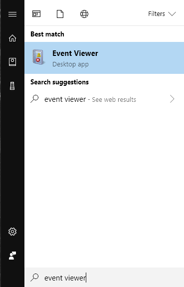
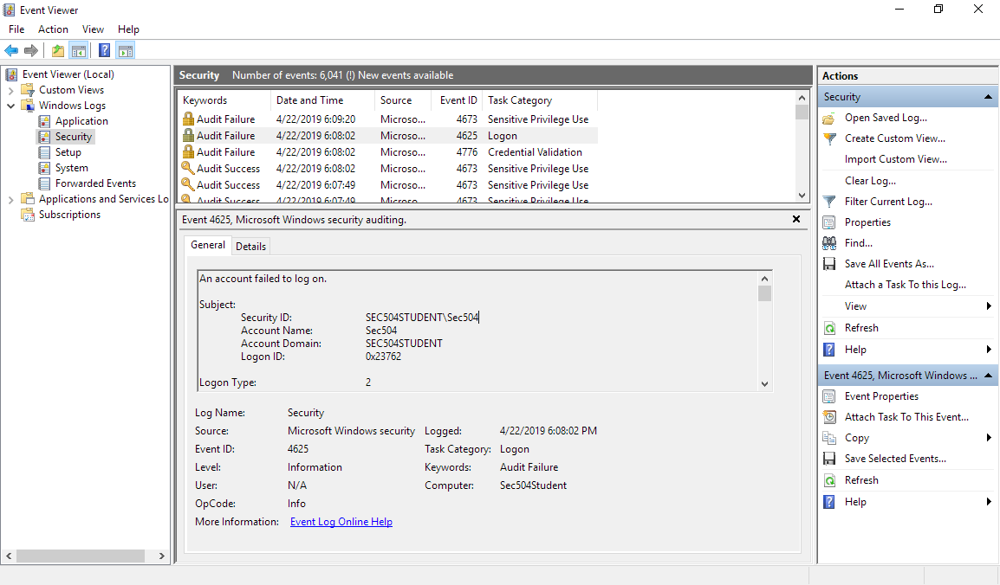
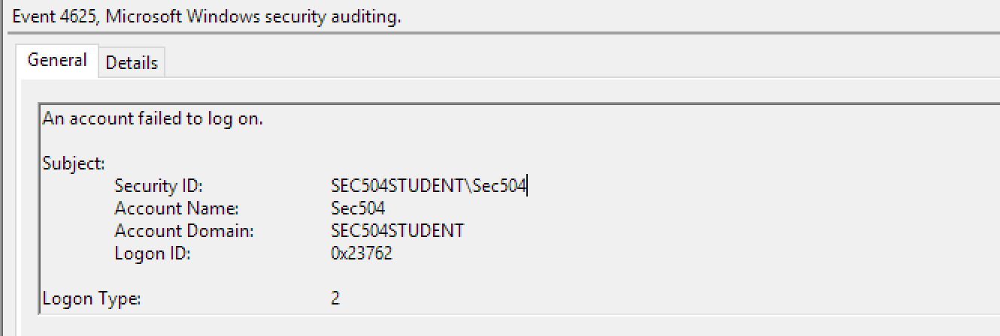
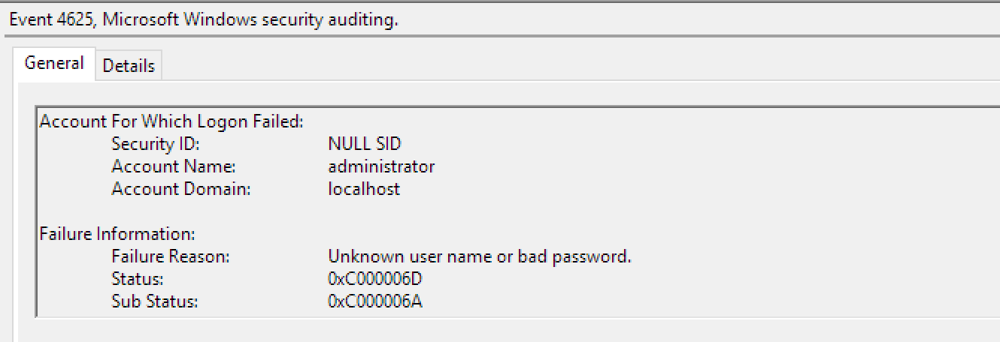
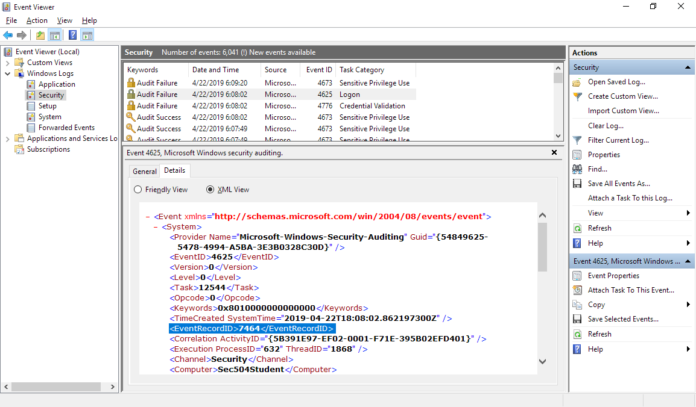
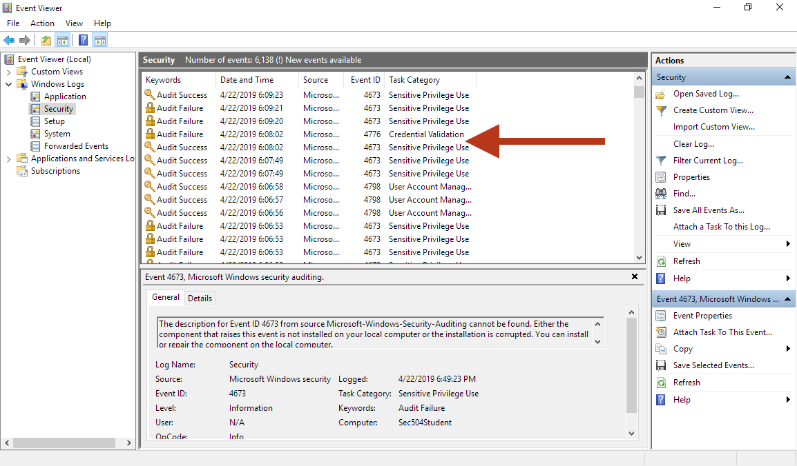
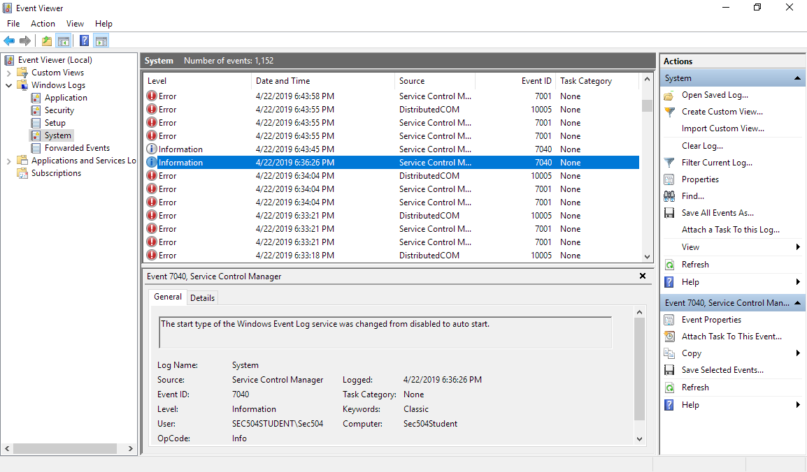
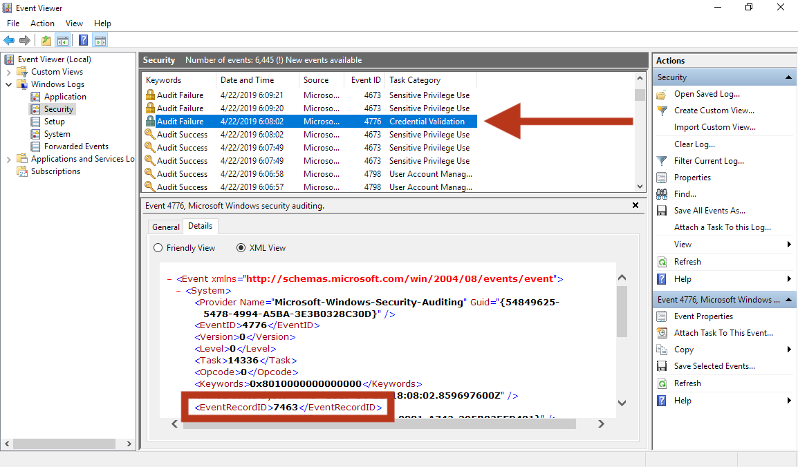
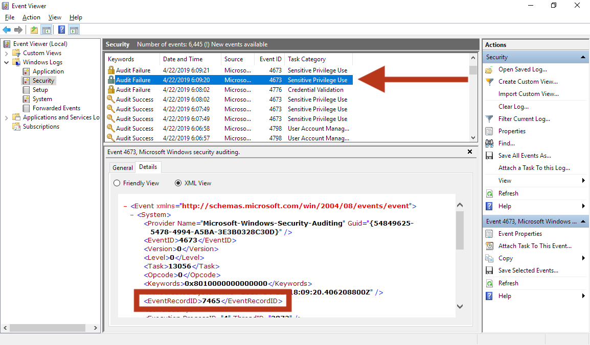

# Lab 5.5: Windows Log Editing

## Brief Intro

Contrary to popular belief, Windows logging is vulnerable to attack. In this
lab we're going to attack the event log in Windows!

## Requirements for This Lab

In this lab you will use your Windows 10 VM. Make sure the VM is
running before continuing with the lab exercise.

## Try It Yourself

Playing the role of an attacker, generate a Windows event log entry and then
remove it using the `C:\Tools\DeleteRecordofFileEx.exe` utility. As a defender,
analyze the Windows event logs to identify evidence of tampering.

## Walkthrough

### Log Editing

In this lab we are going to walk through how an attacker can selectively remove
event logs from a Windows 10 system.  This is important because it gives an
attacker the capability to cover their tracks following an attack.

First you will generate a failed password authentication attempt using the
`runas` command, observing the event with Event Viewer. Next you will remove
that event from the Windows event log. Finally you will observe the removed
event, but also investigate further to identify indicators of Windows event log
tampering.

#### Open an Administrator Command Prompt

From your Windows VM, open a Command Prompt as an Administrator: Click Start,
then right-click on the Command Prompt icon, then click More | Run as
administrator.

### Generating a Failed Login Event (Attacker)

Run the following command to generate a failed login security event.
Please enter a random string of characters when prompted for a password.

<pre>
C:\Users\Sec504> <b>runas /user:localhost\administrator cmd.exe</b>
Enter the password for localhost\administrator: <b><i>badpassword</i></b>
Attempting to start cmd.exe as user "localhost\administrator" ...
RUNAS ERROR: Unable to run - cmd.exe
1326: The user name or password is incorrect.
</pre>

> Keep the Administator Command Prompt open. You will continue to use it
> throughout this lab.

### Open Event Viewer

Next, examine the failed login event in Event Viewer. To start Event Viewer,
press the Windows key while logged in to your class Windows 10 system and type
`event viewer`. This will search for the Event Viewer application. Click to
open the Event Viewer application.

From Event Viewer, click to expand the Windows Logs group. Click to select the
Security Logs. Scroll to observe the failed login attempt with the event ID
**4625**, as shown here.

### Examine the Failed Logon Event

Examine the selected failed login attempt information for the 4625 event ID. Note
the following important information:

+ Which user account attempted to and failed to log in?
+ What was the target account name for the failed login?
+ Was the failed login for a local or a domain account?
+ Why did the login fail?

This information is captured in the selected event _General_ tab, as shown here.

### Note Failed Login Event Time

Identify the date and time for the failed login attempt for later analysis.

> Use a scrap piece of paper or your favorite editor to write this down! You will
> refer to it later in the lab.

### Identify the Failed Logon EventRecordID

Every event in Event Viewer has an _EventRecordID_ value. The [Microsoft
documentation](https://docs.microsoft.com/en-us/windows/desktop/wes/eventschema-eventrecordid-systempropertiestype-element)
indicates that this value is _assigned to an event when it is logged_. In
practice, it is a sequential, positively incrementing value.

To delete the logging entry, you must identify the EventRecordID for the failed
logon event. From Event Viewer, click on the Details tab, then click on the XML
View radio button.  In the XML data, identify the EventRecordID for the
selected event. An example is shown below.

> Note that your EventRecordID will be different than the example shown here!

### Close Event Viewer

Close the Event Viewer application to continue with the attacker steps.

### Delete the Logon Event Log Entry

From the Administrator Command Prompt, use the `DeleteRecordofFileEx.exe`
utility to remove the failed logon attempt event log entry, as shown here.
Supply the EventRecordID value for your logging event identified in the
previous step as the last argument (instead of the example below of _7464_).

<pre>
C:\WINDOWS\system32> <b>c:\tools\DeleteRecordofFileEx.exe Security.evtx <i>7464</i></b>
[+]ReadPath:C:\WINDOWS\system32\winevt\logs\security.evtx
[+]EventRecordID:7464
[+]Delete success
</pre>

The `DeleteRecordofFileEx.exe` utility creates a new event log file called
`temp.evtx` in the current directory. In order to suppress the logging entry
from Event Viewer, you must now replace the standard `Security.evtx` file with
the modified version.

### Stop the Windows Event Log Service

In order to replace a Windows event log EVTX file, it is necessary to stop the
Windows Event log (_eventlog_) service. This service starts automatically even
after stopping, so it is necessary to first disable the service, then stop it.

From the Administrator Command Prompt, temporarily disable the Windows Event
Log service using the `sc` utility, then stop it using the `net` utility, as
shown here. When prompted, answer _yes_ to stop the dependent services as well.

> Note that there is a space following `start=` before `disabled`.

<pre>
C:\WINDOWS\system32> <b>sc config eventlog start= disabled</b>
[SC] ChangeServiceConfig SUCCESS

C:\WINDOWS\system32> <b>net stop eventlog</b>
The following services are dependent on the Windows Event Log service.
Stopping the Windows Event Log service will also stop these services.

   Network List Service
   Network Location Awareness

Do you want to continue this operation? (Y/N) [N]: <b>y</b>
The Network List Service service is stopping.
The Network List Service service was stopped successfully.

.
The Network Location Awareness service was stopped successfully.

The Windows Event Log service is stopping.
The Windows Event Log service was stopped successfully.
</pre>

### Check the Windows Event Log Service

Use the `sc` command to confirm that the Windows Event Log service is stopped,
as shown here.

<pre>
C:\WINDOWS\system32> <b>sc query eventlog</b>

SERVICE_NAME: eventlog
        TYPE               : 20  WIN32_SHARE_PROCESS
        STATE              : 1  STOPPED
        WIN32_EXIT_CODE    : 0  (0x0)
        SERVICE_EXIT_CODE  : 0  (0x0)
        CHECKPOINT         : 0x0
        WAIT_HINT          : 0x0
</pre>

> Note that the service state is _stopped_ in the output here. Ensure that the
> service is stopped before continuing with the lab exercise. If needed, you
> can run the `net stop eventlog` command again if the service is still running.

### Replace the Security.evtx File

Next, replace the Event Viewer `Security.evtx` file with the modified version
in `temp.evtx` using the `copy` command, as shown here:

<pre>
C:\WINDOWS\system32> <b>copy temp.evtx c:\windows\system32\winevt\Logs\Security.evtx</b>
Overwrite c:\windows\system32\winevt\Logs\Security.evtx? (Yes/No/All): <b>y</b>
        1 file(s) copied.
</pre>

### Start the Windows Event Log Service

Next, enable and start the Windows Event Log service using the `sc` and `net`
utilities, as shown here:

> Note that there is a space following `start=` before `auto`.

<pre>
C:\WINDOWS\system32> <b>sc config eventlog start= auto</b>
[SC] ChangeServiceConfig SUCCESS

C:\WINDOWS\system32> <b>net start eventlog</b>
The Windows Event Log service is starting.
The Windows Event Log service was started successfully.
</pre>

Confirm that the service is running using the `sc query eventlog` command, as shown
here:

<pre>
C:\WINDOWS\system32> <b>sc query eventlog</b>

SERVICE_NAME: eventlog
        TYPE               : 20  WIN32_SHARE_PROCESS
        STATE              : 4  RUNNING
                                (STOPPABLE, NOT_PAUSABLE, ACCEPTS_SHUTDOWN)
        WIN32_EXIT_CODE    : 0  (0x0)
        SERVICE_EXIT_CODE  : 0  (0x0)
        CHECKPOINT         : 0x0
        WAIT_HINT          : 0x0
</pre>

### Open Event Viewer

Next, look for the removed entry in Event Viewer. Start Event Viewer by
clicking the Windows key then type `event viewer`. Click the Event Viewer
application icon to open the application.

Expand the Windows Logs group, then click on the Security event log. Inspect
the Event Viewer logs, scrolling if necessary to the time and date of the
previously noted logon event. Notice that the event is no longer present in the
event logs, as shown here.

> In this illustration, the absence of the deleted logging entry is indicated
> with an arrow.

This step concludes the actions taken by an attacker for the exercise.

### Deleted Logging Event Analysis (Defender)

For the next part of this lab exercise you will evaluate the artifacts left
behind following an attacker's modification to the Windows event log data.

### Identify Service Stop Events

Recall in this exercise how it was necessary for the attacker to stop the
Windows event log service in order to replace the `Security.evtx` file with the
modified content. The process of stopping and starting the event log service
will create additional logging entries that may indicate potential tampering of
the event logs.

From Event Viewer, navigate to Windows Logs | System. The System logging
information will record events relating to changes in a system service.

Scroll to the events shortly after the time for the event deleted from your
event log. Click on the event ID **7040** for the _Service Control Manager_
event. In the General tab you will see the event logging message _The start
type of the Windows Event Log service was changed from auto start to disabled_,
as shown here.

This logging message corresponds to the attacker changing the service startup
type from _automatic_ to _disabled_ as part of the process necessary to replace
the `Security.evtx` file. Continue scrolling up to newer events to identify an
additional, associated event with event ID 7040, corresponding to the return of
the event log service from disabled to auto, as shown here.

> Note that the details for your event log entries, including date, time, and
> the other events in the event log will be different for your system.

### Evaluate Gaps in EventRecordID

When using `DeleteRecordofFileEx.exe`, the attacker specfies an EventRecordID
value to remove. The `DeleteRecordofFileEx.exe` tool removes the logging entry
associated with the specified value, but does not update the other remaining
event log entries to update the other EventRecordID values. Careful
inspection of the event logs will reveal that there is a missing
EventRecordID value in a sequence of logging events, as shown in the two
images that follow.

> In these two images, although the two event log messages are sequential, the
> EventRecordID is non-sequential, indicating a potentially deleted message.

The missing EventRecordID is a strong indicator of a manipulated event log, but
identifying this pattern using Event Viewer is tedious to perform manually.

After inspecting the missing entry, close Event Viewer.

### Create a Local Copy of Security.evtx

Return to your Command Prompt. Next, change to a temporary directory
(`C:\temp`) and copy the `Security.evtx` file to the temporary directory, as
shown here:

<pre>
C:\WINDOWS\system32> <b>cd \temp</b>

C:\Temp> <b>copy c:\windows\system32\winevt\Logs\Security.evtx .</b>
        1 file(s) copied.
</pre>

> Note that the `.` at the end of the `copy` command indicates that the copy
> should place the file in the current directory.

### Export Event Log as XML

The python-evtx library written by [Willi
Ballenthin](https://github.com/williballenthin) includes a sample script called
`evtx_dump`. The `evtx_dump` tool reads from the Windows event log evtx file
and extracts the content as an XML file. A simple utility by Joshua Wright
(`evtxRecordIDGaps.exe`) reads from this XML file and identifies gaps in the
EventRecordID values that could indicate removed event log entries.

From the Command Prompt, convert the `Security.evtx` file to XML format, as shown here:

<pre>
C:\Temp> <b>evtx_dump Security.evtx > Security.xml</b>
</pre>

> Note that the `evtx_dump` utility may take a minute or two to complete, and
> does not generate any output.

### Identify Missing EventRecordID Records

Next, use the `evtxRecordIDGaps.exe` utility to read from the XML file, identifying
any non-sequential gaps in the EventRecordID records, as shown here:

<pre>
C:\Temp> <b>evtxRecordIDGaps.exe Security.xml</b>
==== Gap between EventRecordID 7463 and 7465 (2019-04-22 18:08:02.859697 and 2019-04-22 18:09:20.406208)
</pre>

> Note that the EventRecordIDs and the date/timestamps will be different on
> your system than the example shown here.

The output of `evtxRecordIDGaps.exe` indicates that there is a gap between two
EventRecordID values. This is a strong indicator of a compromised system and
Windows event log, also revealing a time frame where you can focus additional
investigation techniques to further evaluate the attack.

### Conclusion

In this lab we covered how an attacker can remove evidence of their
attack from Windows event logs.  The reason this is so important is because it
highlights how we need to correlate and fuse information from multiple sources
to discover and verify an attack.

We also saw how it is possible to identify the evidence indicating the event
log entries were manipulated. This can be a useful indicator when evaluating
a system, revealing useful information about when modifications were made.

## Why This Lab Is Important

All too often defenders are looking for a positive indicator that something
happened. They're looking for a footprint in mud. Sometimes, the absence of
something expected – a forest going suddenly silent – can be an indicator of
something far more sinister.

## Bonus (If Time Permits or Homework)

Experiment with the [Invoke-Phant0m](https://github.com/hlldz/Invoke-Phant0m)
tool, which will kill the event log threads, but keeps the service itself up and
running.  The effect of a tool like this is that any checks looking for a
running event log service will pass, but the service itself is unable to do any
writing.

## Additional Resources

[SANS SEC511: Continuous Monitoring and Security Operations](https://www.sans.org/sec511)
