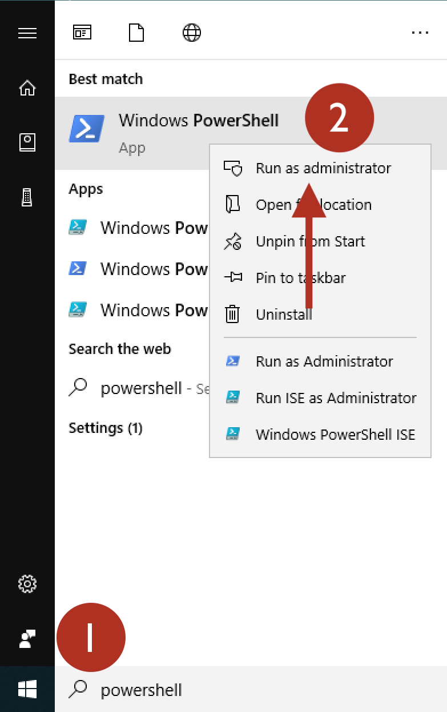
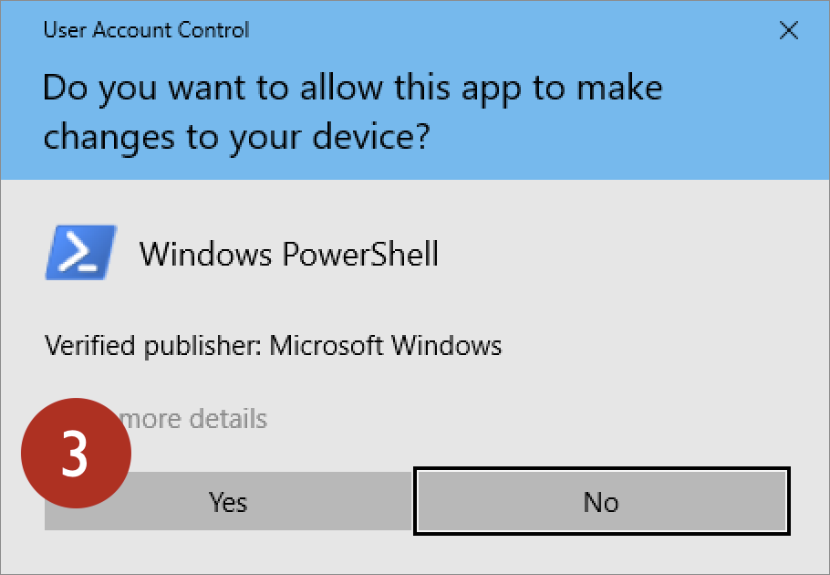
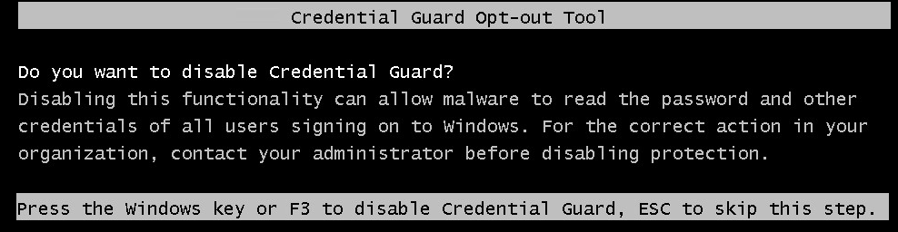
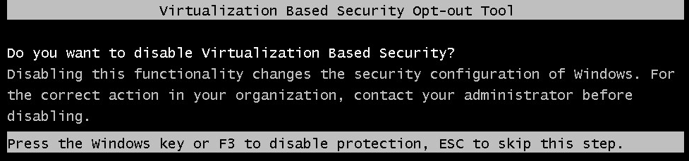

# Disable Credential Guard

Windows 10 Credential Guard offers security benefits for Windows 10 Professional
and Enterprise editions, but is incompatible with VMware. To complete the lab
exercises in this class, you must uninstall Credential Guard to use VMware
for the class virtual machines.

Follow these steps to disable Credential Guard on your Windows 10 host.

## Connect USB Drive

Connect your class USB drive to your laptop. Note the drive letter.

> In the examples below, we will assume the USB drive appears as drive
> letter **E**. Change the examples below to match the drive letter for
> your system.

## Open PowerShell as an Administrator

Click Start. Type _powershell_ in the search box. When the Windows PowerShell 
app appears, right-click on the app icon and choose Run as administrator, as
shown here.

When prompted _Do you want to allow this app to make changes to your device_,
answer Yes, as shown here.

## Allow PowerShell Scripts to Execute

From the PowerShell prompt, run the command `powershell -ep bypass`
to allow the Credential Guard uninstall script to execute, as shown here.

<pre>
PS C:\WINDOWS\system32> <b>powershell -ep bypass</b>
Windows PowerShell
Copyright (C) Microsoft Corporation. All rights reserved.

PS C:\WINDOWS\system32>
</pre>

## Uninstall Credential Guard

Next, run the Microsoft `DG_Readiness_Tool` script from the USB drive `CG` directory,
as shown here:

<pre>
PS C:\WINDOWS\system32> <b>E:\CG\DG_Readiness_Tool.ps1 -Disable</b>

###########################################################################

Readiness Tool Version 3.7 Release.
Tool to check if your device is capable to run Device Guard and Credential Guard.

###########################################################################

...

Please reboot the machine for settings to be applied.
</pre>

## Reboot

Reboot your host system. You will be prompted during the boot process to change
the system configuration to disable Credential Guard and virtualization-based
security. Press **F3** at both prompts to disable these Windows features.

## Start VMware, Launch Guest

After logging in to your host system, start VMware and launch a guest system.
You should no longer be restricted by Credential Guard on your host.

