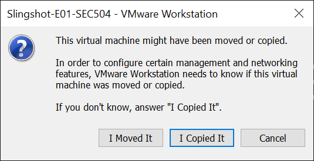
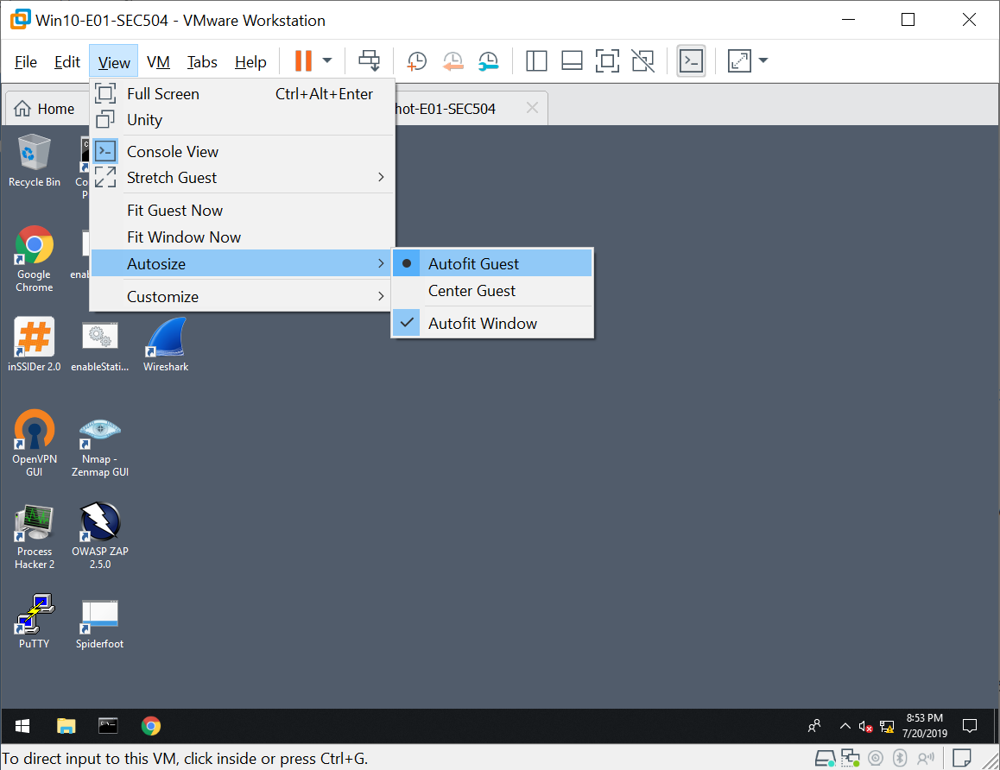

# Getting Started

Follow these steps to get started with the virtual machine systems you will use
for class exercises.

> If you have already copied the lab VMs to your computer, decompressed, and
> booted the systems following the course lecture introductory material, you
> don't have to do it again here!

## Brief Intro

Using VMware, you will boot and run two virtual machine (VM) systems for the
class lab exercises. The VM systems are supplied on your class USB drive. In
this _getting started_ guide, you will copy the compressed VMs to your local
hard drive, decompress them, and boot the two systems.

## Walkthrough

### VMware Required

All of the class lab exercises will utilize VMware as the _hypervisor_ to boot
and run the lab VMs. Please ensure you have already downloaded and installed
VMware on your laptop.

If you have not already installed VMware, download and install it now for your
platform:

+ [VMware Workstation Player for Windows Systems](https://www.vmware.com/products/workstation-player.html)
+ [VMware Fusion for macOS Systems](https://www.vmware.com/products/fusion.html)

You may be eligible for a free trial period of VMware Workstation Player or
VMware Fusion.

> We do not support the use of other virtualization products such as VirtualBox
> or Hyper-V in this class. You are welcome to experiment and try to use these
> platforms, but we cannot provide support for any problems that may arise.

### Copy the VM Files

Insert the USB drive into your laptop. Using Windows Explorer or Finder
(macOS), copy the USB drive contents to your desktop or another convenient
location. This will take several minutes to complete.

### Decompress the Windows 10 VM

Decompress the Windows 10 VM using a Windows or macOS unzip utility. If you do
not have an unzip tool, you can install 7-zip (Windows) or TheArchiver (macOS)
included on the USB drive `Backup` directory.

The decompress process will take several minutes to complete.

### Launch the Windows 10 VM

Launch the Windows 10 VM by double-clicking on the VMware `.vmx` file. VMware
will indicate that the virtual machine might have been copied or moved. Select
**I Copied It** when prompted.

### Log In to the Windows 10 VM

After the Windows 10 VM finishes booting, log in with the following username
and password:

+ Username: **sec000**
+ Password: **sec000**

> That's the last step for Windows! You can keep the Windows 10 VM running and
> continue to experiment, or shut it down until you need it for a lab exercise.
> Next, we will repeat these steps for the Slingshot Linux VM.

### Decompress the Slingshot Linux VM

Decompress the Slingshot Linux VM using a Windows or macOS unzip utility. If
you do not have an unzip tool, you can install 7-zip (Windows) or TheArchiver
(macOS) included on the USB drive `Backup` directory.

The decompress process will take several minutes to complete.

### Launch the Slingshot Linux VM

Launch the Slingshot Linux VM by double-clicking on the VMware `.vmx` file.
VMware will indicate that the virtual machine might have been copied or moved.
Select **I Copied It** when prompted.

### Log In to the Slingshot Linux VM

After the Slingshot Linux VM finishes booting, log in with the following
username and password:

+ Username: **sec000**
+ Password: **sec000**

> That's the last step! You can keep the Slingshot Linux VM running and
> continue to experiment, or shut it down until you need it for a lab exercise.

### Network Connectivity Testing

For normal lab use, the Slingshot Linux and Windows 10 virtual machines should
be able to reach each other with the `ping` utility. You can perform a `ping`
test using the Linux terminal or the Windows 10 Command Prompt, as shown here.

<pre>
C:\Users\Sec000> <b>ping 10.10.75.1</b>

Pinging 10.10.75.1 with 32 bytes of data:
Reply from 10.10.75.1: bytes=32 time<1ms TTL=64
Reply from 10.10.75.1: bytes=32 time=1ms TTL=64
Reply from 10.10.75.1: bytes=32 time<1ms TTL=64
Reply from 10.10.75.1: bytes=32 time<1ms TTL=64

Ping statistics for 10.10.75.1:
    Packets: Sent = 4, Received = 4, Lost = 0 (0% loss),
Approximate round trip times in milli-seconds:
    Minimum = 0ms, Maximum = 1ms, Average = 0ms
</pre>

<pre>
sec000@slingshot:~$ <b>ping -c 4 10.10.0.1</b>
PING 10.10.0.1 (10.10.0.1) 56(84) bytes of data.
64 bytes from 10.10.0.1: icmp_seq=1 ttl=128 time=0.544 ms
64 bytes from 10.10.0.1: icmp_seq=2 ttl=128 time=1.19 ms
64 bytes from 10.10.0.1: icmp_seq=3 ttl=128 time=0.976 ms
64 bytes from 10.10.0.1: icmp_seq=4 ttl=128 time=1.18 ms
--- 10.10.0.1 ping statistics ---
4 packets transmitted, 4 received, 0% packet loss, time 3007ms
rtt min/avg/max/mdev = 0.544/0.973/1.192/0.264 ms
</pre>

If the `ping` command fails on Windows or Linux, use [these tips to
troubleshoot and fix the issue](VM-Connectivity-Test.html). Let an instructor
know if you would like assistance.

## Tips for Windows and Linux

### Screen Size for Linux and Windows

You can customize your screen size for Linux and Windows systems in several
ways.

#### Windows 10 Screen Size

From Windows 10, right-click on an empty part of your desktop and select
Display settings. Experiment with the different resolutions options available
to customize the Windows 10 virtual machine to suit your needs.

Alternatively, you can automatically grow the Windows virtual machine to match
the VMware window. From VMware, click View | Autosize | Autofit Guest to
automatically resize the Windows virtual machine.

#### Slingshot Linux Screen Size

From Slingshot Linux, open a terminal. Run the `xrandr` utility to see a list
of available screen resolutions, as shown here.

<pre>
sec000@slingshot:~$ <b>xrandr</b>
Screen 0: minimum 1 x 1, current 800 x 600, maximum 4096 x 4096
Virtual1 connected primary 800x600+0+0 (normal left inverted right x axis y axis) 0mm x 0mm
   800x600       60.00&#42;+  60.32  
   2560x1600     59.99  
   1920x1440     60.00  
   1856x1392     60.00  
   1792x1344     60.00  
   1920x1200     59.88  
   1600x1200     60.00  
   1680x1050     59.95  
   1400x1050     59.98  
   1280x1024     60.02  
   1440x900      59.89  
   1280x960      60.00  
   1360x768      60.02  
   1280x800      59.81  
   1152x864      75.00  
   1280x768      59.87  
   1024x768      60.00  
   640x480       59.94  
Virtual2 disconnected (normal left inverted right x axis y axis)
Virtual3 disconnected (normal left inverted right x axis y axis)
Virtual4 disconnected (normal left inverted right x axis y axis)
Virtual5 disconnected (normal left inverted right x axis y axis)
Virtual6 disconnected (normal left inverted right x axis y axis)
Virtual7 disconnected (normal left inverted right x axis y axis)
Virtual8 disconnected (normal left inverted right x axis y axis)
</pre>

Change the Slingshot Linux screen resolution to any of the listed values by
running `sudo xrandr -s`, followed by the desired screen resolution, as shown
here.

<pre>
sec000@slingshot:~$ <b>sudo xrandr -s <i>1280x800</i></b>
</pre>

Slingshot Linux will immediately change the screen resolution.

### Linux Terminal Preferences

From Slingshot Linux, you can change the font size and other settings in the
terminal to suit your preferences. Click Edit | Profile Preferences to modify
the default terminal settings.

The Slingshot Linux terminal also supports multiple tabs, which is convenient
when running several commands. Press `Ctrl+Shift+T` to open a new tab from the
terminal.

Copy and paste functionality is essential for working with the terminal. To
highlight a string in the terminal, click and drag the mouse over the string,
or double-click to highlight a single word. Press `Ctrl+Shift+C` to copy
highlighted text. Press `Ctrl+Shift+V` to paste.
