# Lab 5.8: Building Review Cards with Anki [Optional]

This optional lab introduces the steps to build your own course review cards
with Anki.

## Brief Intro

In this optional lab exercise, we will examine the steps to build your own study
and review cards using Anki. This process will focus on creating study and
review cards for the SANS SEC504 Pivoting and Lateral Movement module, but can
be applied to any SANS class or other complex topic of study.

## Walkthrough

### Download Anki

Download the Anki installer for your system from
[https://apps.ankiweb.net/](https://apps.ankiweb.net/). We will use the Windows
version of Anki in this lab, but you may choose to use the macOS or Linux
version as well.

> We recommend using the mobile version of Anki for review only after creating
> your study deck on a Windows, macOS, or Linux host.

### Install Anki

Run the Anki installer, accepting defaults.

### Launch Anki

Launch Anki. The first time you run Anki, it will prompt you to choose your
preferred language. Choose your preferred language to complete the initial
setup wizard.

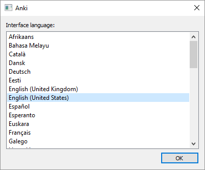

### Create Your First Anki Deck

From the main Anki screen, click the Create Deck option, as shown here.

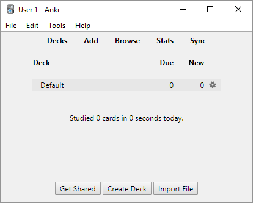

When prompted, enter the deck name _SANS-SEC504_, as shown here. Then click OK.

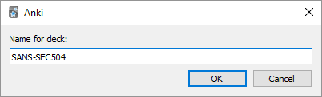

### Create a Module-Specific Anki Deck

Next, click Create Deck again, this time entering the name _Pivoting and
Lateral Movement_, as shown here. Then click OK.

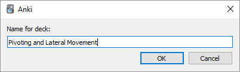

### Move Module Deck Beneath Course Deck

Anki allows you to have several _linked_ decks of cards, allowing you to
organize your cards into different study topics. This is useful since you can
quickly jump to an area of study where you need to spend more time reviewing
the course material.

From Anki, click and drag the Pivoting and Lateral Movement deck, releasing it
on top of the SANS-SEC504 deck. Anki will create the linked relationship, as
shown here.

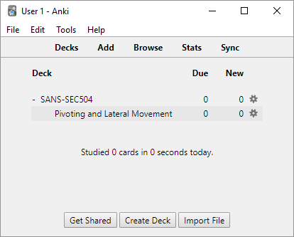

Repeat this process as you build out your Anki deck for the SEC504 course
material. For now, we'll start to create study cards for the Pivoting and
Lateral Movement module.

### Get Out Your Book 5 Materials

Get your SEC504 book 5 materials and flip to the Pivoting and Lateral
Movement module. Get a wide highlighter too.

For each page in the course, highlight **three** topics that warrant additional
study and review. Some pages may require more, but try to find at least three
important points on each page.

Repeat this process for each page in the module, then return here to build
your Anki cards.

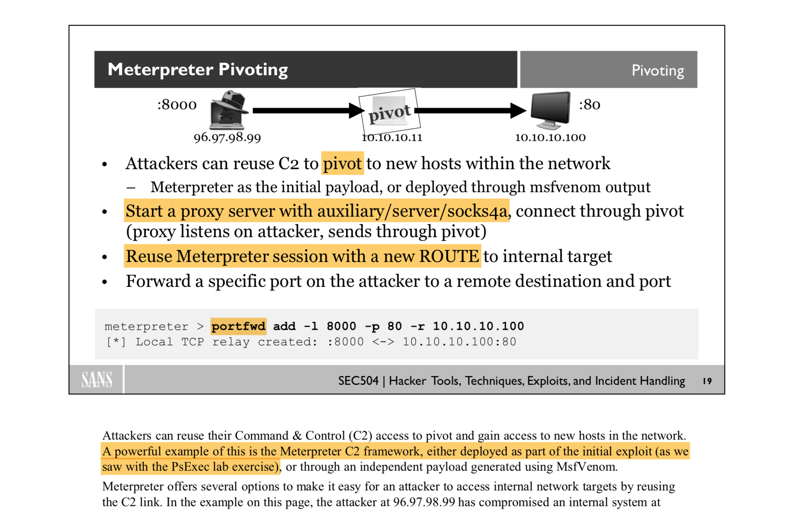

### Add Your First Anki Card

With the Pivoting and Lateral Movement deck section selected, press the **A**
key. Anki will open the Add dialog, as shown here.

Click the Type button. Change the type from _Basic_ to _Cloze_, then click
Choose.

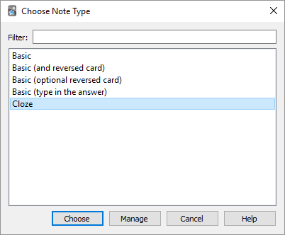

In the Text block, enter the content you highlighted. This may be verbatim
content from the course materials or reworded as you see fit. Don't worry
about composing the text as a question; just capture the important details
from the highlighted course materials. An example is shown here.

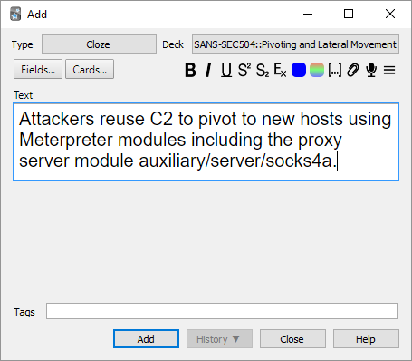

Next, highlight the portion of the text that you want to use for the flash
card review content. Press Ctrl+Shift+C (Cmd+Shift+C on macOS) to create the
Cloze block, as shown here.

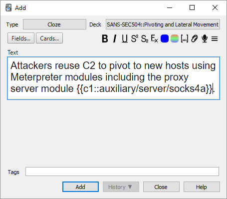

> Note: you may optionally add additional formatting, color coding, search
> tags, and rich media content using the Anki Add toolbar options.

Finally, click Add to add the Anki card to your deck.

### Add More Cards

Repeat this process, adding a new card for each topic you want to build
retention for. Enter the content you highlighted in the book, then
highlight the keyword or phrase and add a Cloze deletion block.

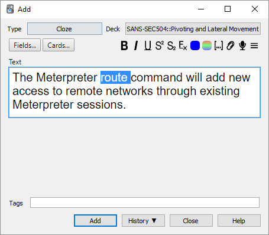

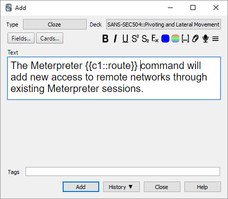

Keep repeating this process until you have captured all of your highlights
in Anki cards. Repeat for other modules as well.

### Use Anki for Spaced Repetition Review

After adding numerous Cloze cards to Anki, use the cards to review your
material. Allocate at least 20-30 minutes per study period.

From Anki, click the SANS-SEC504 master deck link. Click Study Now to
begin your study.

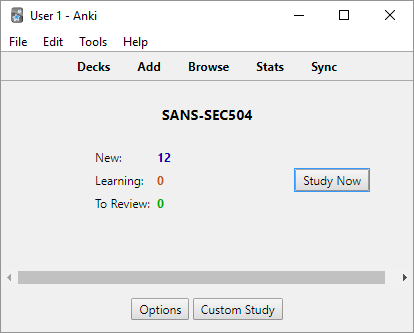

Anki will present you a question with the Cloze block hidden. Answer the
question, and if necessary, use the supporting material from the course books
to recall the answer.

Don't spend more than 30 seconds or 1 minute on any
individual question, then click Show Answer. Anki will present the answer to
the question from the original Cloze input.

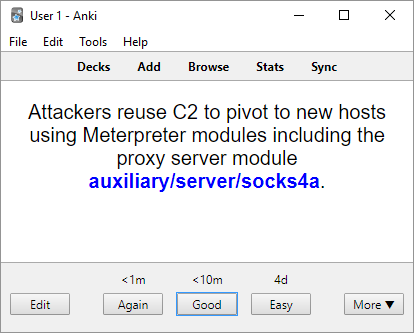

Next, mark how long it took you to recall the answer for the question. If you
knew the answer right away, click Easy (or press shortcut key **3**). If
you had to think for several seconds before coming up with the answer, click
Good (or press shortcut key **2**). If you had to refer to the course books
for the answer, or didn't know the answer at all, click Again (or press
shortcut key **1**).

Anki uses your input following each question to apply spaced repetition for
question review. Questions that you mark as Easy will not reappear for 4 days.
Questions you mark as Good will reappear in less than 10 minutes. Questions
you mark as Again will reappear in less than 1 minute.

> You can adjust the timing intervals used by Anki, but we don't recommend it.
> The default 1m/10m/4d interval works well with a large set of questions and
> has proven effective for many Anki users.

Continue to use Anki for the set-aside time, then stop. Feel free to edit
questions if you can improve them as needed.

### Repeat Your Study

Anki works best when you can allocate time regularly for your review and
study of the materials. In the beginning, with a large set of questions,
you should review your material with sufficient frequency that you get
through all of your Anki cards within 1 week. After the initial review,
you can start adding more spacing between review periods, adding several
days between reviews, to a week, to weeks. Or you can continue to add
more questions to Anki and build long-term recall for different topics
as well.

## Why This Lab is Important

Retention is something that comes with practice, and Anki is a smart way to
build that retention through the use of spaced repetition learning. Using
the steps described in this lab, you can build your Anki deck for SEC504
topics or any other complex subject matter where you wish to excel through
long-term retention and recall ability.

## Additional Resources

+ [Anki user manual](https://apps.ankiweb.net/docs/manual.html)
+ Memory Techniques Wiki, [Spaced Repetition and Recall](https://artofmemory.com/wiki/Spaced_Repetition_and_Recall)
+ [Effective learning: Twenty rules of formulating knowledge by Dr. Piotr Wozniak](https://www.supermemo.com/en/archives1990-2015/articles/20rules)
+ Anki is widely used by med school students and can be similarly applied to
  any other technical field. [Several YouTube videos](How to Use Anki Effectively - Flash Card Basics for Pre-Med and Med Students) provide useful insight into how med school students apply Anki for their studies.
+ A [Guide to Anki Intervals and Learning Steps](https://www.youtube.com/watch?v=1XaJjbCSXT0) by Conan Liu, MS3 at Sidney Kimmey Medical College.

