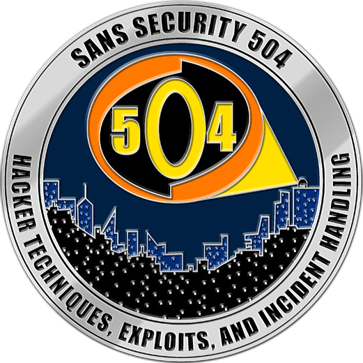

# Home

## Welcome to the SANS SEC504 Instructor Guide!

This instructor guide is designed to provide a central location for supporting
SANS SEC504 instructors when teaching class. Check back here for information
on [Course Updates](Course-Updates.md), [Errata](Errata.md), and other
useful resources.

## Slack Space

If you want to connect with other SEC504 instructors, consider joining the
[Slack space](https://sec504team.slack.com/). [Email
Josh](mailto:jwright@hasborg.com) and we'll add you to the Slack space.

Not really into Slack? No problem. Dig into the resources available on this site
and always feel free to reach out to Josh to Mike.

- Joshua Wright, [jwright@willhackforsushi.com](mailto:jwright@willhackforsushi.com), +1-401-524-2911
- Mike Murr, [mike@socialexploits.com](mike@socialexploits.com), +1-805-338-9977

_Update: 20191021-001_
